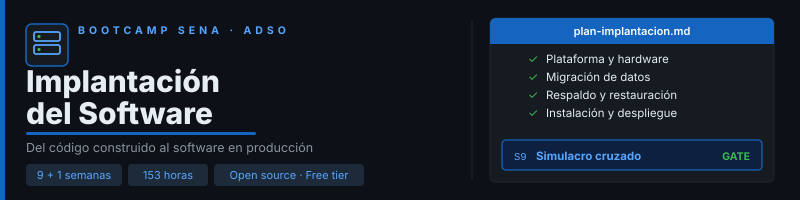

  

  

---

## 📋 Description

A **9-week (+1 optional)** bootcamp for the SENA learning outcome *"Plan software deployment
activities according to system conditions"*, aimed at ADSO training-chain apprentices who have
already built their project.

Each team delivers a **Deployment Plan** for its real project — platform, hardware
requirements, data migration, backups, installation, deployment, security, maintenance —
validated by another team that installs it from scratch following only the document.

- Practice on a shared **reference app** (FastAPI + React + PostgreSQL); weekly deliverable on
  the team's **real project**.
- Open source and free tier only: Ubuntu Server, Docker, PostgreSQL, Caddy, Render,
  Neon/Supabase, GitHub Actions, Uptime Kuma.
- 153 hours (17h/week: 12h guided + 5h autonomous) + 17 optional hours.

See [`docs/plan-curricular.md`](docs/plan-curricular.md) (Spanish) for the full curriculum map.

## 📄 License

[MIT](LICENSE)
