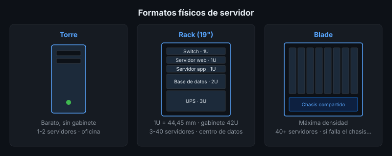

# Hardware de Servidores: Torre, Rack y Blade

## 🎯 Objetivos

- Diferenciar un servidor de un equipo de escritorio
- Comparar los formatos torre, rack y blade según densidad, costo y escenario de uso
- Identificar los componentes de redundancia que hacen a un servidor "de producción"

## 📋 Contenido

### 1. ¿Qué hace diferente a un servidor?

Un servidor no es "un PC potente". Se diseña para **funcionar 24/7 sin detenerse** y para que una
falla de un componente no tumbe el servicio:

| Componente | Equipo de escritorio | Servidor |
|---|---|---|
| Fuente de poder | Una | Dos, redundantes y *hot-swap* (se cambian encendido) |
| Memoria RAM | Estándar | ECC — detecta y corrige errores de bit |
| Discos | Uno o dos, internos | Bahías frontales *hot-swap*, controladora RAID |
| Red | Una tarjeta | Dos o más, para redundancia o agregación |
| Administración | Presencial | Remota fuera de banda (iDRAC, iLO, IPMI/BMC) |
| Procesador | 1 socket | 1 o 2 sockets, más núcleos, más canales de memoria |

La **administración fuera de banda** (BMC) permite encender, reiniciar y ver la consola del
servidor por red aunque el sistema operativo esté caído.

### 2. Formatos físicos

#### Torre

Parece un PC grande. No necesita gabinete especial.

- ✅ Barato, silencioso, fácil de instalar en una oficina
- ❌ Ocupa mucho espacio; no escala más allá de unos pocos equipos
- **Uso típico**: pequeña empresa, sede con un solo servidor de archivos o de aplicaciones

#### Rack

Servidor plano que se atornilla en un **gabinete rack estándar de 19 pulgadas**. Su altura se mide
en **unidades de rack (U)**: 1U = 1,75 in = 44,45 mm. Un gabinete típico tiene 42U.

- ✅ Densidad alta, cableado ordenado, estándar en centros de datos
- ✅ Se combina con switches, UPS y almacenamiento en el mismo gabinete
- ❌ Requiere gabinete, refrigeración y suele ser ruidoso
- **Uso típico**: centro de datos propio, cuarto de servidores de una institución

| Formato | Uso común |
|---|---|
| 1U | Servidores web, de aplicaciones — máxima densidad |
| 2U | Bases de datos, más bahías de disco y más ventilación |
| 4U | Almacenamiento masivo, GPU |

#### Blade

Tarjetas delgadas ("cuchillas") que se insertan en un **chasis** que comparte fuentes de poder,
ventiladores, red y administración.

- ✅ Máxima densidad: muchos servidores en poco espacio y con menos cableado
- ✅ Se agregan servidores insertando una cuchilla
- ❌ Inversión inicial alta (el chasis); dependencia de un solo fabricante
- ❌ Si falla el chasis, fallan todas las cuchillas
- **Uso típico**: grandes centros de datos, clústeres de virtualización

### 3. Criterios para elegir

| Pregunta | Torre | Rack | Blade |
|---|:---:|:---:|:---:|
| ¿Hay cuarto de servidores con gabinete? | No hace falta | Sí | Sí |
| ¿Cuántos servidores se esperan en 3 años? | 1-2 | 3-40 | 40+ |
| ¿Presupuesto inicial bajo? | ✅ | ➖ | ❌ |
| ¿Se requiere alta densidad? | ❌ | ✅ | ✅✅ |

### 4. ¿Y la nube?

En la nube el hardware existe, pero no lo administras tú: el proveedor opera miles de servidores
rack o blade y te alquila una fracción (una VM o un contenedor). Por eso en la nube hablas de
**vCPU**, **GB de RAM** y **tipo de disco**, no de formatos físicos. Los conceptos de esta
lección siguen siendo útiles para leer la ficha técnica de una instancia y entender por qué cuesta
lo que cuesta.

### 5. Aplicación al proyecto real

Tu proyecto probablemente no necesita un blade. En la ficha técnica
([`3-proyecto/`](../3-proyecto/README.md)) indica qué formato físico recomendarías **si** el
cliente quisiera alojarlo en sus instalaciones, y justifícalo con la tabla de la sección 3.

## 📚 Recursos Adicionales

Ver [`4-recursos/webgrafia/`](../4-recursos/webgrafia/README.md).
