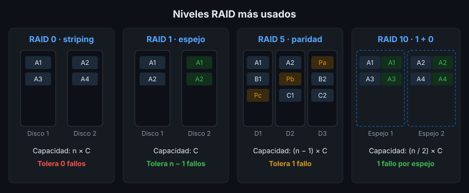

# Arreglos de Discos (RAID)

## 🎯 Objetivos

- Explicar qué problema resuelve un arreglo RAID
- Calcular capacidad útil y tolerancia a fallos de RAID 0, 1, 5, 6 y 10
- Elegir un nivel RAID según el tipo de carga del software
- Entender por qué **RAID no es un respaldo**

## 📋 Contenido

### 1. ¿Qué es RAID?

**RAID** (*Redundant Array of Independent Disks*) combina varios discos físicos para que el
sistema los vea como uno solo, buscando:

- **Rendimiento**: repartir lecturas/escrituras entre varios discos (*striping*)
- **Tolerancia a fallos**: guardar copia o paridad para sobrevivir a la falla de un disco

Técnicas base:

| Técnica | Qué hace |
|---|---|
| *Striping* (franjas) | Divide los datos en bloques y los reparte entre discos |
| *Mirroring* (espejo) | Escribe exactamente lo mismo en dos o más discos |
| Paridad | Guarda un cálculo (XOR) que permite reconstruir el bloque de un disco perdido |

### 2. Niveles

Con **n** discos de capacidad **C** cada uno:

| Nivel | Mín. discos | Capacidad útil | Tolera | Lectura | Escritura | Uso típico |
|---|:---:|---|---|:---:|:---:|---|
| RAID 0 | 2 | n × C | **0 discos** | Alta | Alta | Datos temporales, caché |
| RAID 1 | 2 | C | n − 1 discos | Alta | Normal | Disco del sistema operativo |
| RAID 5 | 3 | (n − 1) × C | 1 disco | Alta | Baja | Archivos, lectura intensiva |
| RAID 6 | 4 | (n − 2) × C | 2 discos | Alta | Más baja | Almacenamiento grande |
| RAID 10 | 4 | (n / 2) × C | 1 por espejo | Alta | Alta | **Bases de datos** |

**Ejemplo** con 4 discos de 2 TB:

| Nivel | Capacidad útil | Si fallan 2 discos… |
|---|---|---|
| RAID 0 | 8 TB | Se pierde todo (basta con 1) |
| RAID 5 | 6 TB | Se pierde todo |
| RAID 6 | 4 TB | Sigue funcionando |
| RAID 10 | 4 TB | Sobrevive si no son del mismo espejo |

### 3. Penalización de escritura

En RAID 5 cada escritura lógica cuesta **4 operaciones** físicas (leer dato, leer paridad,
escribir dato, escribir paridad); en RAID 6 cuesta 6; en RAID 10 cuesta 2. Por eso las bases de
datos con muchas escrituras suelen ir en **RAID 10**, aunque "pierda" la mitad de la capacidad.

### 4. RAID por hardware vs por software

| | Hardware | Software |
|---|---|---|
| Quién lo gestiona | Controladora dedicada (con caché y batería) | El sistema operativo (`mdadm` en Linux, ZFS) |
| Costo | Controladora aparte | Gratis |
| Portabilidad | Atada a la controladora | Los discos se leen en otro Linux |

En la nube no configuras RAID: el proveedor ya replica los discos virtuales. Lo que eliges es el
**tipo de disco** (HDD, SSD, NVMe) y sus **IOPS**.

### 5. RAID no es respaldo

RAID protege contra la **falla física de un disco**. **No** protege contra:

- Borrar una tabla por error (el borrado se replica al instante en todos los discos)
- Ransomware o archivos corruptos
- Incendio, robo o falla de la controladora

Por eso la semana 2 diseña un **plan de respaldo** aparte. RAID y respaldo se complementan.

### 6. Aplicación al proyecto real

En la ficha técnica recomienda un nivel RAID para el servidor de base de datos de tu proyecto y
justifica la elección con capacidad útil, tolerancia y patrón de escritura.

## 📚 Recursos Adicionales

Ver [`4-recursos/webgrafia/`](../4-recursos/webgrafia/README.md).
