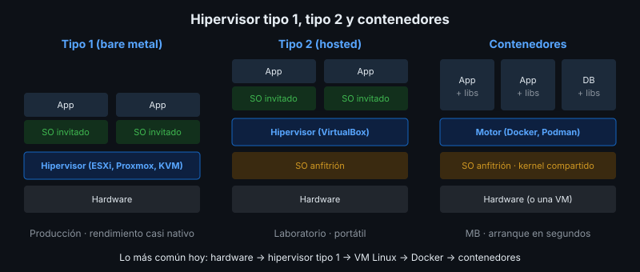

# Máquinas Virtuales y Contenedores

## 🎯 Objetivos

- Explicar qué es un hipervisor y diferenciar tipo 1 y tipo 2
- Ubicar VMware, Proxmox VE, KVM y VirtualBox en esa clasificación
- Comparar máquinas virtuales con contenedores
- Decidir qué combinación usar para implantar un proyecto

## 📋 Contenido

### 1. Virtualización

Una **máquina virtual (VM)** es un computador completo simulado por software: tiene su propia
CPU virtual, RAM, disco y **su propio sistema operativo**. El software que crea y administra las
VM es el **hipervisor**.

Ventajas frente a instalar directo sobre el hardware (*bare metal*):

- Un servidor físico aloja muchos servidores lógicos → mejor aprovechamiento
- Instantáneas (*snapshots*) antes de un cambio riesgoso
- Mover una VM a otro servidor físico sin reinstalar
- Aislamiento: si una VM falla, las demás siguen

### 2. Hipervisores tipo 1 y tipo 2



| | Tipo 1 (*bare metal*) | Tipo 2 (*hosted*) |
|---|---|---|
| Dónde se instala | Directo sobre el hardware | Como aplicación sobre un SO anfitrión |
| Rendimiento | Cercano al nativo | Menor (pasa por el SO anfitrión) |
| Uso | Producción, centros de datos | Laboratorio, pruebas en el portátil |
| Ejemplos | VMware ESXi, Proxmox VE, KVM, Microsoft Hyper-V | VirtualBox, VMware Workstation |

Notas sobre cada producto:

- **VMware vSphere/ESXi**: líder histórico en empresas. Tras la compra de VMware por Broadcom
  (2023) el licenciamiento pasó a suscripciones y la oferta gratuita ha cambiado varias veces;
  verifica las condiciones vigentes antes de recomendarlo.
- **Proxmox VE**: plataforma completa basada en Debian + KVM, con interfaz web, *snapshots* y
  respaldos. Licencia AGPLv3, gratis; la suscripción es opcional (soporte y repositorio estable).
- **KVM**: hipervisor integrado en el kernel de Linux. Es la base de Proxmox y de muchas nubes.
- **VirtualBox**: tipo 2, gratuito, ideal para practicar en el portátil.

### 3. Contenedores

Un **contenedor** empaqueta una aplicación con sus dependencias, pero **comparte el kernel del
sistema operativo anfitrión**. No simula hardware ni arranca un sistema operativo completo.

| | Máquina virtual | Contenedor |
|---|---|---|
| Aísla | Hardware completo, SO propio | Procesos, archivos y red |
| Tamaño | GB | MB |
| Arranque | Minutos | Segundos |
| Kernel | Propio | Compartido con el anfitrión |
| Aislamiento de seguridad | Más fuerte | Menor (comparte kernel) |
| Herramientas | Hipervisores | Docker, Podman |

### 4. En la práctica se combinan

La arquitectura más común hoy:

```
Hardware (rack) → Hipervisor tipo 1 → VM Ubuntu Server → Docker → contenedores de la app
```

- La **VM** da aislamiento, *snapshots* y la puedes mover de servidor físico.
- **Docker** hace que la app se instale igual en el portátil, la VM del laboratorio y la nube.

Así trabajaremos en este bootcamp: VM Ubuntu del laboratorio (o un contenedor `ubuntu` si no hay
VM) + Docker Compose para la app de referencia.

### 5. Aplicación al proyecto real

En la ficha técnica indica la plataforma de ejecución de tu proyecto (bare metal, VM,
contenedores o combinación) y justifícala.

## 📚 Recursos Adicionales

Ver [`4-recursos/webgrafia/`](../4-recursos/webgrafia/README.md).
