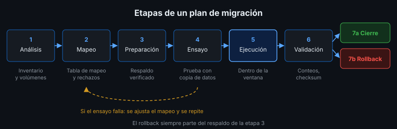

# Diseño del Plan de Migración

## 🎯 Objetivos

- Identificar las etapas de un plan de migración y el entregable de cada una
- Construir la tabla de mapeo y las reglas de transformación
- Definir validaciones objetivas y un plan de rollback
- Evaluar riesgos con probabilidad, impacto y mitigación

## 📋 Contenido

### 1. Etapas

| # | Etapa | Pregunta que responde | Entregable |
|---|---|---|---|
| 1 | Análisis | ¿Qué hay en el origen, cuánto y en qué estado? | Inventario de origen con volúmenes |
| 2 | Mapeo | ¿A dónde va cada dato y cómo se transforma? | Tabla de mapeo + reglas de rechazo |
| 3 | Preparación | ¿Qué necesito antes de empezar? | Respaldo verificado, ventana acordada, scripts |
| 4 | Ensayo | ¿Funciona con una copia? | Ejecución en ambiente de pruebas con resultados |
| 5 | Ejecución | — | Migración en producción dentro de la ventana |
| 6 | Validación | ¿Llegó todo y bien? | Conciliación, checksums, aprobación del cliente |
| 7 | Cierre o rollback | ¿Seguimos o volvemos atrás? | Acta de cierre o restauración |

### 2. Objetivos

Un objetivo de migración es **medible**. Compara:

- ❌ "Migrar los clientes al sistema nuevo"
- ✅ "Migrar el 100 % de los clientes válidos del sistema viejo a `socios`, con un reporte de
  rechazos revisado por el cliente, en una ventana máxima de 2 horas y sin modificar los socios
  existentes"

### 3. Tabla de mapeo

| Origen | Destino | Transformación | Regla de rechazo |
|---|---|---|---|
| `codigo` | `documento` | `trim` | — |
| `nombre_completo` | `nombre` | `trim` + mayúscula inicial | — |
| `correo` | `email` | `trim` + minúsculas | Vacío → rechazar; duplicado → conservar el más antiguo |
| `fecha_alta` (`dd/mm/yyyy`) | `fecha_registro` (`DATE`) | Conversión de formato | Fecha inexistente → rechazar |
| `telefono` | — | No se migra | — |

Cada columna del origen aparece en la tabla, incluso las que **no** se migran (con la razón).

### 4. Validación

La validación debe ser **objetiva y automatizable**, no "se ve bien":

| Técnica | Qué demuestra |
|---|---|
| Conciliación de conteos | origen = migrados + rechazados; no se perdió nada sin explicación |
| Checksum (hash) | El contenido migrado es exactamente el esperado |
| Reglas de negocio | El destino cumple sus restricciones (formatos, rangos) |
| Datos previos intactos | La migración no alteró lo que ya existía |
| Muestreo manual | El cliente revisa una muestra y la aprueba |

### 5. Rollback

El plan dice **antes** de empezar cuándo y cómo se vuelve atrás:

- **Criterio de rollback**: ej. "si alguna validación falla y no se corrige en 30 minutos"
- **Rollback principal**: restaurar el respaldo tomado justo antes de migrar
- **Rollback lógico**: script que borra solo lo migrado — útil solo si no hubo otros cambios
- **Responsable** de decidir el rollback (nombre de rol, no de persona)

### 6. Matriz de riesgos

| Riesgo | Prob. | Impacto | Mitigación |
|---|:---:|:---:|---|
| Datos de origen con formatos no previstos | Alta | Medio | Staging + ensayo con copia real del origen |
| La migración excede la ventana | Media | Alto | Medir tiempo en el ensayo; ventana con margen |
| Se pierden datos sin notarlo | Baja | Alto | Conciliación de conteos + checksum |
| No se puede volver atrás | Baja | Crítico | Respaldo verificado antes de iniciar |
| El cliente rechaza el resultado | Media | Alto | Reglas de rechazo aprobadas por el cliente antes de ejecutar |

Probabilidad e impacto: Baja / Media / Alta / Crítico. Prioriza los de impacto alto aunque
parezcan improbables.

### 7. Aplicación al proyecto real

¿Tu proyecto tiene datos que migrar? Casi siempre sí: datos iniciales, catálogos, usuarios o
la información que el cliente hoy maneja en hojas de cálculo. Identifica el origen real y diseña
el plan con esta estructura en el entregable.

## 📚 Recursos Adicionales

Ver [`4-recursos/webgrafia/`](../4-recursos/webgrafia/README.md).
