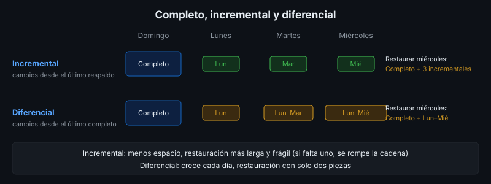
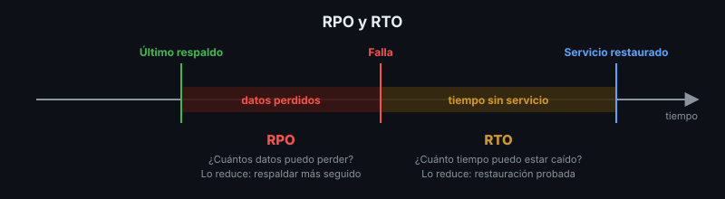
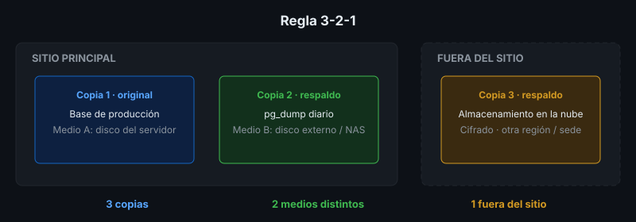

# Copias de Seguridad

## 🎯 Objetivos

- Identificar qué se debe respaldar en un software implantado
- Diferenciar respaldo completo, incremental y diferencial; lógico y físico
- Aplicar la regla 3-2-1 y definir RPO y RTO
- Definir frecuencia, retención y protección de los respaldos

## 📋 Contenido

### 1. ¿Qué se respalda?

No solo la base de datos:

| Qué | Ejemplo | ¿Se puede reconstruir sin respaldo? |
|---|---|---|
| Base de datos | Tablas de PostgreSQL | ❌ No |
| Archivos subidos por usuarios | `/uploads`, imágenes, PDF | ❌ No |
| Configuración | `.env`, `compose.yaml`, config de Caddy | ⚠️ Con esfuerzo |
| Secretos | Claves, certificados | ⚠️ Algunos no (claves de cifrado) |
| Código | Repositorio Git | ✅ Ya está en GitHub |
| Imágenes Docker | Imágenes publicadas en un registro | ✅ Se reconstruyen |

Los secretos se respaldan **cifrados** y separados de los datos.

### 2. Tipos según qué copian

| Tipo | Copia | Espacio | Restaurar requiere |
|---|---|---|---|
| **Completo** | Todo | Alto | Solo ese respaldo |
| **Incremental** | Lo cambiado desde el **último respaldo de cualquier tipo** | Mínimo | Completo + **todos** los incrementales en orden |
| **Diferencial** | Lo cambiado desde el **último completo** | Crece cada día | Completo + **el último** diferencial |

### 3. Lógico vs físico (PostgreSQL)

| | Lógico | Físico |
|---|---|---|
| Herramienta | `pg_dump` / `pg_restore` | `pg_basebackup` + archivado de WAL |
| Qué guarda | Sentencias y datos (independiente de la versión) | Archivos del motor, bloque a bloque |
| Portabilidad | Restaura en otra versión u otro servidor | Misma versión mayor |
| Recuperación a un punto en el tiempo | ❌ Solo al momento del respaldo | ✅ PITR: a cualquier segundo |
| Apto para | Bases pequeñas y medianas, migraciones | Bases grandes, RPO de minutos |

En este bootcamp se usa respaldo lógico. Los servicios gestionados (Neon, Supabase) ofrecen
recuperación a un punto en el tiempo con límites según el plan: revísalo en la semana 4.

### 4. RPO y RTO

- **RPO** (*Recovery Point Objective*): cuántos datos **puedes perder**, medido en tiempo. Si
  respaldas cada 24 h, tu RPO es de hasta 24 h.
- **RTO** (*Recovery Time Objective*): cuánto tiempo **puede estar caído** el servicio hasta
  volver a operar.

Los define el **cliente** según el negocio; el plan demuestra cómo se cumplen.

### 5. Regla 3-2-1

- **3** copias de los datos (la original + 2 respaldos)
- en **2** medios distintos (disco del servidor + almacenamiento externo)
- **1** copia fuera del sitio (otra sede, la nube)

Variante moderna **3-2-1-1-0**: además, 1 copia inmutable o desconectada (protege contra
ransomware) y 0 errores en la verificación de restauración.

### 6. Frecuencia, retención y protección

- **Frecuencia**: la define el RPO. RPO de 24 h → respaldo diario como mínimo.
- **Retención**: cuánto tiempo se conservan. Esquema común *GFS* (abuelo-padre-hijo): 7
  diarios, 4 semanales, 12 mensuales.
- **Cifrado**: el respaldo contiene los mismos datos personales que producción.
- **Acceso**: quien puede borrar producción no debería poder borrar los respaldos.
- **Automatización**: un respaldo manual se olvida. Se programa (cron en la semana 6).

### 7. Aplicación al proyecto real

Define para tu proyecto: qué se respalda, RPO y RTO, tipo y frecuencia, retención, dónde se
guarda cada copia (3-2-1) y quién es responsable.

## 📚 Recursos Adicionales

Ver [`4-recursos/webgrafia/`](../4-recursos/webgrafia/README.md).
