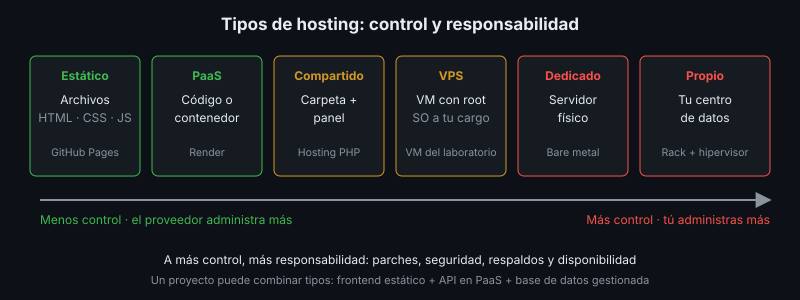

# Tipos de Hosting

## 🎯 Objetivos

- Diferenciar hosting estático, compartido, VPS, dedicado, PaaS y contenedores
- Relacionar cada tipo con el nivel de control y de responsabilidad que asume el equipo
- Ubicar los gestores de contenido dentro de estas opciones
- Seleccionar el tipo de hosting adecuado para un software

## 📋 Contenido

### 1. ¿Qué es hosting?

**Hosting** (alojamiento) es el servicio que mantiene un software accesible en Internet: un
servidor encendido, conectado a la red, con una dirección pública. La pregunta al elegirlo no es
solo "¿cuánto cuesta?", sino **¿qué administra el proveedor y qué administro yo?**

### 2. El espectro control ↔ responsabilidad

| Tipo | Qué te entregan | Qué administras tú | Ejemplos | Apto para |
|---|---|---|---|---|
| **Estático** | Espacio para archivos HTML/CSS/JS + CDN + HTTPS | Solo los archivos | GitHub Pages, Cloudflare Pages | Frontend SPA, documentación, landing |
| **Compartido** | Una carpeta en un servidor compartido con otros clientes, panel de control | Archivos y una base de datos | Planes de hosting web tradicionales | Sitios PHP pequeños |
| **VPS** | Una máquina virtual con acceso root | Sistema operativo, seguridad, servicios, respaldos | VM en un proveedor cloud, VM del laboratorio | Control total a bajo costo |
| **Dedicado** | Un servidor físico completo | Todo lo del VPS + hardware contratado | Servidores bare metal | Carga alta, requisitos regulatorios |
| **PaaS** | Plataforma que ejecuta tu código o contenedor | Código y configuración | Render, Railway, Fly.io | APIs y apps web sin administrar servidores |
| **Contenedores gestionados / serverless** | Ejecución de contenedores o funciones bajo demanda | Imagen o función | Cloud Run, AWS Lambda | Cargas variables |

Regla general: **a más control, más responsabilidad**. Un VPS te deja instalar cualquier cosa,
pero si no aplicas parches de seguridad, nadie lo hará por ti.

### 3. Hosting compartido: por qué no para este bootcamp

El hosting compartido tradicional está pensado para sitios PHP con panel de control y acceso por
FTP. Limitaciones para un software moderno:

- No permite Docker ni procesos que corran permanentemente (una API en Python o Node)
- Versiones del lenguaje y de la base de datos fijadas por el proveedor
- Recursos compartidos: el sitio vecino puede afectar el tuyo

### 4. Gestores de contenido (CMS)

Un **CMS** (*Content Management System*) permite a personas sin conocimientos técnicos publicar
contenido: páginas, noticias, imágenes. Hay dos modelos:

| Modelo | Cómo funciona | Hosting típico |
|---|---|---|
| Tradicional (monolítico) | El CMS genera y sirve las páginas | Compartido o VPS |
| Headless | El CMS solo expone una API; otro frontend muestra el contenido | PaaS + hosting estático |

En este bootcamp no se instala ningún CMS: cada equipo implanta **su propio software**. Lo
importante es reconocer que un CMS es un software más con los mismos requisitos: servidor,
base de datos, respaldos, actualizaciones de seguridad y plan de instalación.

### 5. Criterios de selección

| Pregunta | Orienta hacia |
|---|---|
| ¿El software es solo archivos estáticos? | Hosting estático |
| ¿Corre en contenedores y el equipo no quiere administrar servidores? | PaaS |
| ¿Necesitas control del sistema operativo o servicios adicionales? | VPS |
| ¿El cliente exige que los datos queden en sus instalaciones? | Servidor propio (VPS en su infraestructura) |
| ¿Presupuesto cero? | Free tier de PaaS + hosting estático (semana 4) |

Un mismo proyecto puede combinar tipos: frontend en hosting estático, API en PaaS y base de datos
gestionada.

### 6. Aplicación al proyecto real

En el entregable elige el tipo de hosting para cada componente de tu proyecto y justifícalo con
esta tabla.

## 📚 Recursos Adicionales

Ver [`4-recursos/webgrafia/`](../4-recursos/webgrafia/README.md).
