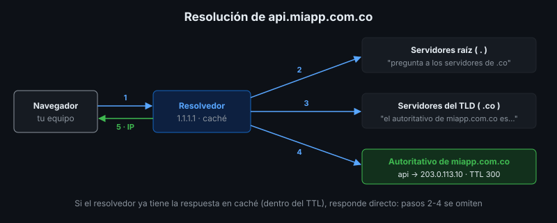

# Dominios y DNS

## 🎯 Objetivos

- Explicar qué es un dominio, un registrador y un TLD
- Describir cómo se resuelve un nombre de dominio
- Configurar los registros DNS básicos (A, AAAA, CNAME, TXT, MX, NS) y su TTL
- Conocer opciones gratuitas de dominio para proyectos formativos

## 📋 Contenido

### 1. Nombre de dominio

Un **dominio** es un nombre legible que reemplaza una dirección IP. Se lee de derecha a izquierda:

| Parte | Ejemplo en `api.miapp.com.co` | Quién la administra |
|---|---|---|
| Raíz | `.` (implícita) | Organización mundial de Internet |
| TLD (dominio de nivel superior) | `co` | Registro del país o del TLD |
| Segundo nivel | `com.co` | Registro del TLD |
| Dominio registrado | `miapp.com.co` | Tú, a través de un registrador |
| Subdominio | `api.miapp.com.co` | Tú, sin costo adicional |

- **Registrador**: empresa a la que le compras (alquilas) el dominio por años.
- El dominio **se renueva**: si vence, cualquiera puede registrarlo. La fecha de vencimiento va
  en el plan de mantenimiento (semana 8).

### 2. Resolución DNS



1. El navegador pregunta al **resolvedor** configurado (el del proveedor de Internet, `1.1.1.1`,
   `8.8.8.8`).
2. Si no lo tiene en caché, el resolvedor pregunta a los **servidores raíz**, que responden
   quién atiende el TLD.
3. Los **servidores del TLD** responden quién es el servidor **autoritativo** del dominio.
4. El **autoritativo** responde la IP. El resolvedor la guarda en caché durante el TTL.

### 3. Registros DNS

| Tipo | Para qué | Ejemplo |
|---|---|---|
| `A` | Nombre → IPv4 | `miapp.com.co → 203.0.113.10` |
| `AAAA` | Nombre → IPv6 | `miapp.com.co → 2001:db8::10` |
| `CNAME` | Alias de otro nombre | `www → miapp.com.co` · `api → miapp.onrender.com` |
| `TXT` | Texto: verificación de propiedad, políticas de correo (SPF) | `v=spf1 -all` |
| `MX` | Servidores de correo del dominio, con prioridad | `10 mail.miapp.com.co` |
| `NS` | Servidores autoritativos del dominio | `ns1.proveedor-dns.com` |

Las IP `203.0.113.x` y `2001:db8::` de los ejemplos están reservadas para documentación.

Reglas útiles:

- Un `CNAME` **no** puede estar en el dominio raíz (`miapp.com.co`), solo en subdominios.
- Los PaaS (semana 4) piden normalmente un `CNAME` hacia su nombre, y un `TXT` para verificar
  que el dominio es tuyo.

### 4. TTL y propagación

El **TTL** (*Time To Live*) indica cuántos segundos puede guardarse una respuesta en caché.
"Propagación DNS" no es un proceso activo: es el tiempo que tardan las cachés en vencer.

Buena práctica antes de cambiar una IP:

1. Uno o dos días antes, bajar el TTL del registro (ej. de 86400 a 300).
2. Hacer el cambio.
3. Cuando todo funcione, volver a subir el TTL.

### 5. Dominios para proyectos formativos

| Opción | Costo | Ejemplo | Limitación |
|---|---|---|---|
| Subdominio del PaaS | Gratis | `miapp.onrender.com` | Nombre del proveedor en la URL |
| DuckDNS | Gratis | `miapp.duckdns.org` | Solo registros A/AAAA/TXT |
| Dominio propio | Pago anual | `miapp.com.co` | Costo y renovación |
| Dominio `.test` / `/etc/hosts` | Gratis | `sitio.lab.test` | Solo en tu equipo o laboratorio |

### 6. Herramientas

```bash
dig +short miapp.com A         # consultar un registro
dig @1.1.1.1 miapp.com A       # preguntar a un resolvedor específico
dig +trace miapp.com A         # ver el camino completo
```

### 7. Aplicación al proyecto real

En el entregable define el dominio (o subdominio gratuito) de tu proyecto y la tabla de
registros DNS que necesitarías, con su TTL.

## 📚 Recursos Adicionales

Ver [`4-recursos/webgrafia/`](../4-recursos/webgrafia/README.md).
