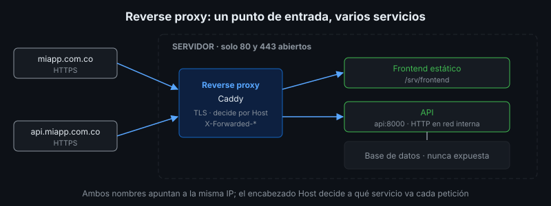

# Servidor Web, Reverse Proxy y HTTPS

## 🎯 Objetivos

- Diferenciar servidor web, servidor de aplicaciones y reverse proxy
- Explicar cómo un servidor atiende varios sitios por nombre (virtual hosts)
- Entender cómo se obtiene y renueva un certificado HTTPS
- Leer y modificar una configuración básica de Caddy

## 📋 Contenido

### 1. Tres roles

| Rol | Qué hace | Ejemplos |
|---|---|---|
| Servidor web | Entrega archivos estáticos | Caddy, Nginx |
| Servidor de aplicaciones | Ejecuta el código del backend | Uvicorn, Node.js |
| Reverse proxy | Recibe todas las peticiones y las reenvía al servicio interno que corresponde | Caddy, Nginx, Traefik |

En la práctica, **un solo programa** (Caddy o Nginx) suele cumplir los roles de servidor web y
reverse proxy.

### 2. ¿Por qué un reverse proxy?



- **Un solo punto de entrada**: solo los puertos 80 y 443 quedan abiertos a Internet; la API y la
  base de datos no se exponen.
- **HTTPS en un solo lugar**: el proxy termina TLS; los servicios internos hablan HTTP en la red
  privada.
- **Varios sitios en un servidor**: decide por el nombre de dominio.
- **Cambiar el backend sin que el usuario lo note**: nueva versión, otro puerto, otro contenedor.

### 3. Virtual hosts

Varios dominios pueden apuntar a la **misma IP**. El navegador envía en cada petición el
encabezado `Host` con el nombre que escribió el usuario, y el proxy elige el sitio con ese dato.

```
GET / HTTP/1.1
Host: api.miapp.com.co
```

### 4. Encabezados de reenvío

Cuando el proxy reenvía una petición, el backend ve la IP **del proxy**, no la del usuario. Por
eso el proxy agrega:

| Encabezado | Contiene |
|---|---|
| `X-Forwarded-For` | IP original del cliente |
| `X-Forwarded-Proto` | Protocolo original (`https`) |
| `X-Forwarded-Host` | Nombre original solicitado |

El backend los usa para registrar IP reales, generar enlaces `https://` correctos y limitar
peticiones por usuario.

### 5. HTTPS y certificados

HTTPS cifra la comunicación y demuestra la identidad del servidor con un **certificado** firmado
por una **autoridad de certificación (CA)** en la que confía el navegador.

- **Let's Encrypt**: CA gratuita y automatizada. Emite certificados de corta duración (90 días,
  con tendencia a reducirse), por eso la renovación siempre se automatiza.
- **ACME**: protocolo con el que el servidor pide y renueva certificados sin intervención humana.
- Requisito: el dominio debe apuntar (DNS) al servidor, y el puerto 80 o 443 debe ser accesible
  desde Internet para que la CA verifique que controlas el dominio.

**Caddy** obtiene y renueva certificados automáticamente con solo escribir el nombre del
dominio. En el laboratorio, como `.test` no existe en Internet, se usa `tls internal`: Caddy
firma con su propia CA local, que el navegador no reconoce.

### 6. Configuración de Caddy

Ejemplo **ilustrativo** para un servidor real:

```
miapp.com.co {
	root * /srv/frontend
	file_server
}

api.miapp.com.co {
	reverse_proxy api:8000
}
```

Con eso Caddy: escucha en 80 y 443, obtiene certificados para ambos nombres, redirige HTTP a
HTTPS, sirve el frontend y reenvía la API. `caddy reload` aplica cambios sin cortar conexiones y,
si la nueva configuración tiene errores, conserva la anterior.

### 7. Aplicación al proyecto real

En el entregable dibuja el camino de una petición a tu proyecto: dominio → DNS → proxy →
servicio, e indica qué puertos quedan abiertos a Internet.

## 📚 Recursos Adicionales

Ver [`4-recursos/webgrafia/`](../4-recursos/webgrafia/README.md).
