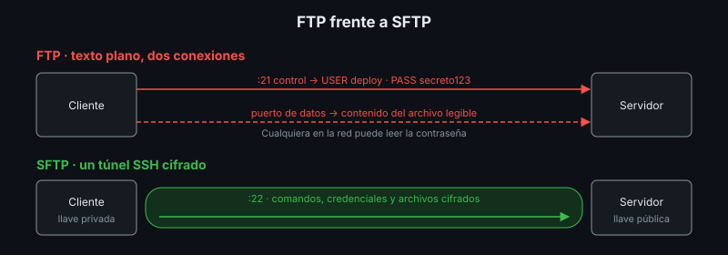

# Transferencia de Archivos: FTP, SFTP, `scp` y `rsync`

## 🎯 Objetivos

- Explicar el funcionamiento de FTP y por qué es inseguro
- Diferenciar FTP, FTPS y SFTP
- Transferir archivos con SFTP, `scp` y `rsync` usando llaves SSH
- Elegir el método de transferencia adecuado para un despliegue

## 📋 Contenido

### 1. FTP

**FTP** (*File Transfer Protocol*, 1971) fue durante décadas la forma estándar de subir archivos
a un hosting.

- Usa **dos conexiones**: control (puerto 21, comandos) y datos (otro puerto, para cada archivo).
- **Modo activo**: el servidor abre la conexión de datos hacia el cliente — choca con firewalls.
- **Modo pasivo**: el cliente abre ambas conexiones — el modo habitual hoy.
- ⚠️ Usuario, contraseña y archivos viajan **en texto plano**: cualquiera en la misma red puede
  leerlos.

### 2. Comparación



| | FTP | FTPS | SFTP | `scp` | `rsync` sobre SSH |
|---|---|---|---|---|---|
| Base | Protocolo propio | FTP + TLS | SSH | SSH | SSH |
| Puertos | 21 + datos | 21/990 + datos | 22 | 22 | 22 |
| Cifrado | ❌ | ✅ | ✅ | ✅ | ✅ |
| Autenticación con llave | ❌ | Certificados | ✅ | ✅ | ✅ |
| Explorar y renombrar remoto | ✅ | ✅ | ✅ | ❌ | ❌ |
| Solo transfiere lo que cambió | ❌ | ❌ | ❌ | ❌ | ✅ |
| Requiere en el servidor | Servidor FTP | Servidor FTP + certificado | OpenSSH | OpenSSH | OpenSSH + `rsync` + acceso a terminal |

**FTP no se usa** en un plan de implantación actual. Si un proveedor solo ofrece FTP, se exige
FTPS como mínimo, o se cambia de proveedor.

### 3. SFTP

**SFTP** (*SSH File Transfer Protocol*) no es "FTP seguro": es un protocolo distinto que viaja
dentro de SSH. Un servidor con OpenSSH ya lo tiene.

Buena práctica en servidores: un usuario de despliegue **solo SFTP**, encerrado en su carpeta
(*chroot*) y sin terminal. Puede subir archivos, pero no ejecutar comandos.

### 4. Autenticación con llaves SSH

| Archivo | Dónde va | Se comparte |
|---|---|---|
| Llave privada (`id_ed25519`) | Solo en tu equipo | ❌ Nunca |
| Llave pública (`id_ed25519.pub`) | En `~/.ssh/authorized_keys` del servidor | ✅ Sí |

```bash
ssh-keygen -t ed25519 -C "deploy-miapp"       # generar
ssh-copy-id usuario@servidor                  # copiar la pública (servidores con terminal)
```

Ventajas frente a contraseña: no se puede adivinar por fuerza bruta, permite automatizar
despliegues y se revoca borrando una línea del servidor.

### 5. Herramientas

```bash
# SFTP interactivo y no interactivo
sftp usuario@servidor
printf 'put build.zip\n' | sftp -b - usuario@servidor

# scp: copia simple (en OpenSSH 9+ usa el protocolo SFTP por defecto; antes, -s)
scp -s build.zip usuario@servidor:/srv/app/

# rsync: sincroniza carpetas, solo envía diferencias
rsync -avz --delete dist/ usuario@servidor:/srv/app/dist/
```

`rsync --delete` borra en el destino lo que no existe en el origen: pruébalo primero con
`--dry-run`.

### 6. ¿Y con contenedores?

Con Docker y PaaS casi no se suben archivos a mano: se publica una **imagen** y el servidor la
descarga (semanas 4 y 7). SFTP sigue siendo útil para archivos que no van en la imagen:
respaldos, cargas masivas de datos, contenido estático, o servidores sin Docker.

### 7. Aplicación al proyecto real

En el entregable indica qué archivos de tu proyecto se transfieren al servidor, con qué método
y con qué tipo de autenticación.

## 📚 Recursos Adicionales

Ver [`4-recursos/webgrafia/`](../4-recursos/webgrafia/README.md).
