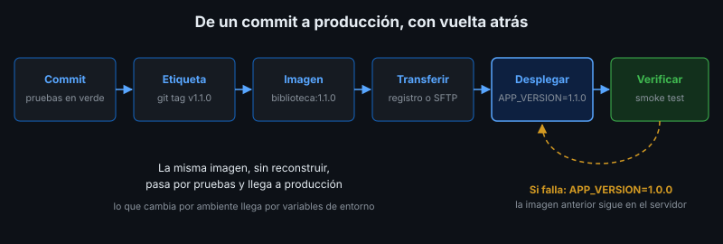
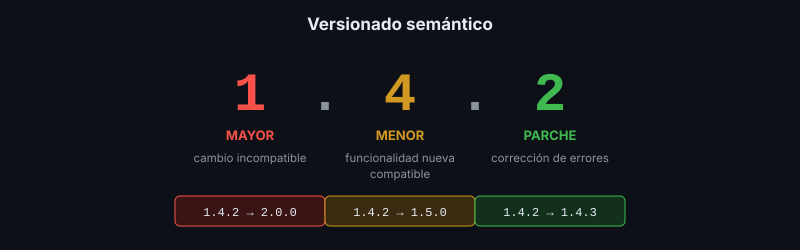

# Procedimientos de Liberación del Software

## 🎯 Objetivos

- Definir qué es una liberación (*release*) y qué artefactos produce
- Aplicar versionado semántico
- Etiquetar versiones en Git y en imágenes de contenedor
- Redactar notas de versión y una lista de verificación de liberación

## 📋 Contenido

### 1. ¿Qué es liberar?

**Liberar** es convertir un estado del código en una **versión identificable, reproducible e
instalable**. No es "subir lo último a producción": es producir un artefacto con nombre fijo que
se puede instalar hoy, dentro de un mes o en otro servidor, y obtener exactamente lo mismo.



| Elemento | Ejemplo |
|---|---|
| Número de versión | `1.1.0` |
| Etiqueta en Git | `v1.1.0` → apunta a un commit exacto |
| Artefacto | Imagen `biblioteca:1.1.0` (o un `.zip`, un `.jar`, un instalador) |
| Notas de versión | Qué cambió, qué hay que hacer al actualizar |

### 2. Versionado semántico (SemVer)



Formato `MAYOR.MENOR.PARCHE`:

| Parte | Se incrementa cuando… | Ejemplo |
|---|---|---|
| MAYOR | Hay cambios incompatibles (el usuario o integrador debe adaptarse) | `1.4.2` → `2.0.0` |
| MENOR | Se agrega funcionalidad compatible | `1.4.2` → `1.5.0` |
| PARCHE | Se corrigen errores sin cambiar funcionalidad | `1.4.2` → `1.4.3` |

Al subir una parte, las de la derecha vuelven a cero. `0.x.y` indica desarrollo inicial: todo
puede cambiar.

### 3. Etiquetas en Git

```bash
git tag -a v1.1.0 -m "Versión 1.1.0: índice de búsqueda por título"
git push origin v1.1.0
git tag --list
```

Una etiqueta **no se mueve**: si hay un error en `v1.1.0`, se publica `v1.1.1`, nunca se
reescribe la etiqueta.

### 4. Imágenes con etiqueta inmutable

```bash
docker build -t biblioteca:1.1.0 --build-arg APP_VERSION=1.1.0 .
```

- ✅ Despliega siempre una etiqueta de versión concreta
- ❌ No despliegues `latest`: no dice qué versión corre, y dos servidores con `latest` pueden
  tener imágenes distintas
- La misma imagen pasa por pruebas y llega a producción: **no se reconstruye** para cada ambiente

### 5. Configuración fuera del artefacto

La imagen es igual en todos los ambientes; lo que cambia (base de datos, dominio, claves) llega
por **variables de entorno** al desplegar. Una imagen con contraseñas adentro no se puede
compartir ni reutilizar. Se profundiza en la semana 5.

### 6. Notas de versión

```markdown
## 1.1.0 — 2026-10-05

### Agregado
- Índice para búsquedas por título

### Cambiado
- Título de la aplicación: "Biblioteca Municipal"

### Al actualizar
- La migración 002 se aplica sola al arrancar (menos de 1 segundo)
- Compatible con volver a 1.0.0: la migración solo agrega un índice
```

La sección **"Al actualizar"** es la que lee quien instala: pasos manuales, migraciones,
variables nuevas, tiempo de parada esperado.

### 7. Lista de verificación de liberación

- [ ] Pruebas automáticas en verde
- [ ] Versión incrementada según SemVer
- [ ] Notas de versión escritas, con sección "Al actualizar"
- [ ] Etiqueta Git creada y publicada
- [ ] Imagen construida con la etiqueta de versión
- [ ] Imagen probada con la prueba de humo antes de desplegar
- [ ] ¿Se puede volver a la versión anterior? ¿Cómo?

### 8. Aplicación al proyecto real

Define el esquema de versiones de tu proyecto, libera la versión `1.0.0` (etiqueta + imagen +
notas) y agrega la lista de verificación al plan de instalación.

## 📚 Recursos Adicionales

Ver [`4-recursos/webgrafia/`](../4-recursos/webgrafia/README.md).
