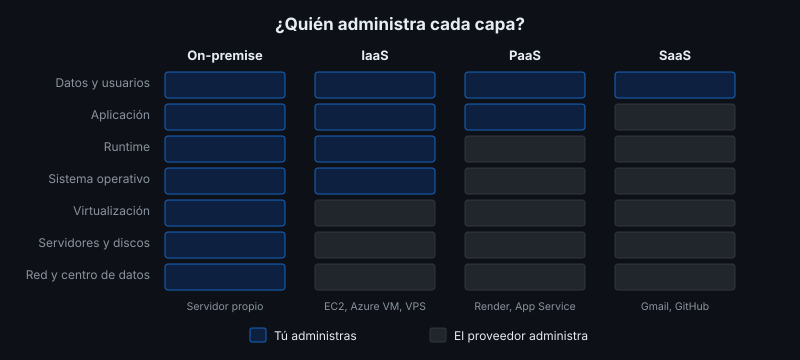

# Cloud Computing: Modelos y Proveedores

## 🎯 Objetivos

- Definir cloud computing y sus características esenciales
- Diferenciar IaaS, PaaS y SaaS y el modelo de responsabilidad compartida
- Diferenciar nube pública, privada e híbrida
- Ubicar a los principales proveedores y servicios gratuitos

## 📋 Contenido

### 1. ¿Qué es la nube?

**Cloud computing** es usar recursos de cómputo (servidores, almacenamiento, bases de datos,
software) de un proveedor, **bajo demanda y pagando por uso**, a través de Internet.

Características esenciales (definición de NIST):

| Característica | Significa |
|---|---|
| Autoservicio bajo demanda | Creas un servidor en minutos, sin hablar con nadie |
| Acceso amplio por red | Se administra y usa desde Internet |
| Recursos compartidos | El proveedor reparte su hardware entre muchos clientes |
| Elasticidad | Aumentas o reduces recursos según la carga |
| Servicio medido | Pagas por lo que consumes (horas, GB, peticiones) |

### 2. Modelos de servicio

| Modelo | Te entregan | Tú administras | Ejemplos |
|---|---|---|---|
| **On-premise** | Nada | Todo, desde el hardware | Servidor propio (semana 1) |
| **IaaS** | Máquinas virtuales, redes, discos | SO, parches, runtime, app, datos | AWS EC2, Azure VM, Google Compute Engine, Oracle Cloud |
| **PaaS** | Plataforma que ejecuta tu código o contenedor | App y datos | Render, Railway, Fly.io, Azure App Service |
| **DBaaS** | Base de datos gestionada | Esquema y datos | Neon, Supabase, Amazon RDS |
| **SaaS** | Software listo para usar | Solo tus datos y usuarios | Gmail, GitHub, Microsoft 365 |

**Responsabilidad compartida**: la seguridad se reparte. En IaaS, si no aplicas parches al
sistema operativo, es tu responsabilidad; en PaaS, el proveedor los aplica. En **todos** los
modelos, tus datos, tus usuarios y tus credenciales son tu responsabilidad.

### 3. Modelos de despliegue

| Modelo | Descripción |
|---|---|
| Nube pública | Infraestructura del proveedor compartida entre clientes |
| Nube privada | Infraestructura dedicada a una organización (propia o de un proveedor) |
| Nube híbrida | Combinación: por ejemplo, datos sensibles en servidores propios y frontend en la nube |

### 4. Proveedores

| Tipo | Proveedores | Comentario |
|---|---|---|
| Grandes nubes | AWS, Microsoft Azure, Google Cloud, Oracle Cloud | Cientos de servicios; free tier con límites y normalmente exigen tarjeta |
| PaaS orientados a desarrolladores | Render, Railway, Fly.io | Despliegue desde GitHub o imagen Docker |
| Bases de datos gestionadas | Neon, Supabase | PostgreSQL con plan gratuito |
| Hosting estático | GitHub Pages, Cloudflare Pages | Gratuito para sitios estáticos |

> **Heroku** fue durante años la referencia de PaaS gratuito; eliminó su plan gratuito en 2022.
> Por eso en este bootcamp se usa Render.

### 5. Regiones y latencia

Los proveedores tienen centros de datos en **regiones**. Elige la región más cercana a los
usuarios (menor latencia) y a la base de datos: una API en Estados Unidos consultando una base
en Europa suma latencia en **cada** consulta. Considera también si hay requisitos legales sobre
dónde se guardan los datos personales.

### 6. Dependencia del proveedor

Cada servicio propietario que usas (colas, funciones, bases exclusivas) hace más difícil cambiar
de proveedor (*vendor lock-in*). Una imagen Docker + PostgreSQL estándar se mueve entre Render,
un VPS o un servidor propio con cambios mínimos: por eso la app de referencia está construida así.

### 7. Aplicación al proyecto real

Clasifica cada componente de tu proyecto según el modelo de servicio en que lo desplegarás
y justifica la región.

## 📚 Recursos Adicionales

Ver [`4-recursos/webgrafia/`](../4-recursos/webgrafia/README.md).
