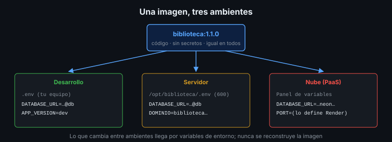

# Configuración del Software por Ambientes

## 🎯 Objetivos

- Separar código, configuración y secretos
- Configurar el software con variables de entorno según el principio 12-factor
- Entender el orden de precedencia de la configuración en Docker Compose
- Hacer que el software falle rápido y con claridad cuando falta configuración

## 📋 Contenido

### 1. Código, configuración y secretos

| | Qué es | Dónde vive | Ejemplo |
|---|---|---|---|
| **Código** | Igual en todos los ambientes | Repositorio → imagen | `app/main.py` |
| **Configuración** | Cambia entre ambientes, no es sensible | Variables de entorno | `APP_VERSION`, `LOG_LEVEL`, dominio |
| **Secretos** | Cambia entre ambientes y **es sensible** | Variables de entorno cargadas desde un lugar protegido | `DATABASE_URL`, claves de API |

Prueba de fuego (12-factor): ¿podrías publicar hoy el repositorio como código abierto sin
exponer ninguna credencial? Si no, hay configuración mezclada con el código.

### 2. Ambientes



| Ambiente | Para qué | Datos |
|---|---|---|
| Desarrollo | Programar y probar en el equipo | Sintéticos, se borran sin problema |
| Pruebas (*staging*) | Validar una versión antes de producción | Sintéticos o copia anonimizada |
| Producción | Usuarios reales | Reales, respaldados |

**Paridad entre ambientes**: cuanto más se parecen (misma imagen, misma versión de PostgreSQL,
mismo proxy), menos sorpresas al desplegar. Una app probada con SQLite en desarrollo y desplegada
con PostgreSQL en producción falla en producción.

### 3. Variables de entorno en Docker Compose

```yaml
services:
  app:
    image: biblioteca:${APP_VERSION}
    environment:
      DATABASE_URL: ${DATABASE_URL:?Define DATABASE_URL en .env}
```

- `${VAR}` se reemplaza al leer el archivo (interpolación).
- `${VAR:?mensaje}` **detiene** Compose con ese mensaje si la variable no existe.
- `${VAR:-valor}` usa un valor por defecto.

Orden de precedencia de la interpolación (el primero gana):

1. Variables exportadas en la terminal (`DATABASE_URL=... docker compose up`)
2. Archivo de variables: `.env` de la carpeta del proyecto, o el indicado con `--env-file`
   (que **reemplaza** a `.env`, no se suma)

`docker compose config` muestra el resultado final ya interpolado: úsalo para depurar antes de
desplegar (y no lo pegues en un chat: muestra los secretos).

### 4. Un archivo por ambiente

```bash
docker compose --env-file .env.pruebas up -d
docker compose --env-file .env.produccion up -d
```

Todos fuera del repositorio; en el repositorio solo `.env.example` con nombres y valores
ficticios.

### 5. Fallar rápido

Un software mal configurado debe **negarse a arrancar** con un mensaje claro, no arrancar y
fallar horas después con el primer usuario.

| Situación | Mal | Bien |
|---|---|---|
| Falta `DATABASE_URL` | Arranca y falla en la primera consulta | No arranca: "Falta DATABASE_URL" |
| La base no responde al arrancar | Arranca "sano" | No arranca o reporta `unhealthy` |
| Valor inválido (`LOG_LEVEL=verbose`) | Se ignora en silencio | Error con los valores permitidos |

La app de referencia falla al arrancar si falta `DATABASE_URL` o si no alcanza la base (porque
aplica migraciones al iniciar). En la práctica 01 mejoras el mensaje.

### 6. Secretos: reglas mínimas

- Nunca en el repositorio, ni en la imagen (`ENV` en el Dockerfile), ni en los logs
- En el servidor: `.env` con permisos `600` y dueño el usuario de despliegue
- En un PaaS: en el panel de variables del servicio
- Si un secreto se filtró (commit, captura de pantalla), se **cambia**: borrarlo del
  repositorio no basta, queda en el historial

### 7. Aplicación al proyecto real

Haz el inventario de toda la configuración de tu proyecto: nombre, si es secreto, valor por
ambiente (ficticio) y qué pasa si falta.

## 📚 Recursos Adicionales

Ver [`4-recursos/webgrafia/`](../4-recursos/webgrafia/README.md).
