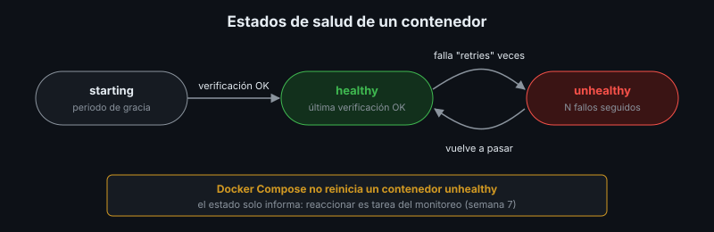

# Healthchecks y Pruebas Posteriores al Despliegue

## 🎯 Objetivos

- Diseñar un endpoint de salud útil
- Interpretar los estados de salud de un contenedor
- Diferenciar pruebas de humo, funcionales y de aceptación
- Construir una lista de verificación posterior al despliegue

## 📋 Contenido

### 1. ¿Qué responde un healthcheck?

| Pregunta | Nombre habitual | Si falla… |
|---|---|---|
| ¿El proceso está vivo? | *Liveness* | Reiniciarlo |
| ¿Puede atender usuarios (alcanza la base, tiene su configuración)? | *Readiness* | No enviarle tráfico |

`/api/health` de la app de referencia es de tipo *readiness*: responde `200` solo si alcanza la
base de datos, y `503` si no.

Buenas prácticas:

- Rápido (milisegundos) y sin efectos secundarios: no escribe datos
- Revisa las dependencias **críticas**, no todo (si el correo falla, la app sigue sirviendo)
- No expone información sensible: nada de cadenas de conexión ni versiones de librerías en el
  mensaje de error

### 2. Estados en Docker



```dockerfile
HEALTHCHECK --interval=10s --timeout=3s --start-period=15s --retries=3 \
    CMD python -c "import urllib.request; urllib.request.urlopen('http://127.0.0.1:8000/api/health', timeout=2)"
```

| Estado | Significa |
|---|---|
| `starting` | Dentro del periodo de gracia (`start-period`) |
| `healthy` | La última verificación pasó |
| `unhealthy` | Falló `retries` veces seguidas |

```bash
docker compose ps
docker inspect --format '{{json .State.Health}}' <contenedor>
```

### 3. Tipos de prueba después de desplegar

| Prueba | Pregunta | Quién | Duración |
|---|---|---|---|
| **Humo** (*smoke*) | ¿Lo esencial responde? | Script automático | Segundos |
| **Funcional** | ¿Cada funcionalidad hace lo que debe? | Script y/o persona con lista de casos | Minutos a horas |
| **Aceptación** | ¿Cumple lo acordado con el cliente? | El cliente (semana 9) | Horas a días |

La prueba de humo **siempre** se ejecuta después de cada despliegue, actualización o rollback.
Si falla, no se sigue: se revierte.

### 4. Diseño de una prueba de humo

`referencia/scripts/smoke-test.sh`:

- Recibe la URL como parámetro: sirve para local, servidor y nube
- Verifica código HTTP esperado, no solo "que responda"
- Incluye un caso de **error esperado** (duplicado → `409`, datos inválidos → `422`)
- Termina con código `0` o `1`: se puede usar en scripts y en CI (semana 7)
- No deja basura: los datos de prueba se reconocen (`smoke-test`)

### 5. Casos de prueba funcional

Formato mínimo:

| ID | Caso | Pasos | Resultado esperado | Resultado obtenido |
|---|---|---|---|---|
| F-01 | Agregar libro válido | Llenar formulario, "Agregar" | Aparece en la tabla | |
| F-02 | ISBN duplicado | Agregar un ISBN existente | Mensaje "ya existe un libro con ese ISBN" | |
| F-03 | Recargar la página | F5 después de agregar | El libro sigue ahí (persistió) | |

### 6. Lista de verificación posterior al despliegue

- [ ] Todos los servicios `healthy` (`docker compose ps`)
- [ ] Prueba de humo en verde contra la URL pública
- [ ] Versión reportada = versión desplegada
- [ ] Sin errores nuevos en los logs de los últimos minutos
- [ ] HTTPS válido (certificado vigente, redirección desde HTTP)
- [ ] Casos funcionales críticos ejecutados
- [ ] Resultado registrado (fecha, versión, quién, resultado)

### 7. Aplicación al proyecto real

Diseña el endpoint de salud de tu proyecto, adapta la prueba de humo y escribe al menos cinco
casos funcionales.

## 📚 Recursos Adicionales

Ver [`4-recursos/webgrafia/`](../4-recursos/webgrafia/README.md).
