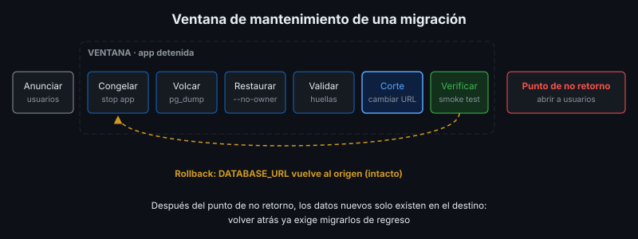

# Ejecutar una Migración a una Base Gestionada

## 🎯 Objetivos

- Ejecutar el plan de migración de la semana 2 en un caso real: local → nube
- Resolver diferencias de versión, dueño y permisos entre servidores
- Validar la migración con conteos y checksums por tabla
- Hacer el corte y tener listo el rollback

## 📋 Contenido

### 1. El caso

La app funciona en un servidor con su propio PostgreSQL y se va a mover a una base gestionada
(Neon, Supabase). Es una migración **de base de datos** con estrategia **big bang**: mismo
esquema, otro servidor.



### 2. Diferencias que aparecen

| Diferencia | Síntoma | Solución |
|---|---|---|
| El usuario dueño no existe en el destino | `role "biblioteca" does not exist` al restaurar | `pg_restore --no-owner --no-acl` |
| Versión distinta de PostgreSQL | `pg_dump` rechaza un servidor más nuevo que él | Usar `pg_dump` de versión igual o mayor al origen, y destino igual o mayor |
| Conexión cifrada obligatoria | Conexión rechazada | `sslmode=require` en la cadena de conexión |
| Extensiones no disponibles | Error al crear una extensión | Revisar la lista de extensiones del proveedor antes |
| Límite de conexiones | La app falla bajo carga | Revisar el límite del plan y los procesos de la app |

### 3. Procedimiento

1. **Anunciar** la ventana de mantenimiento.
2. **Congelar escrituras**: detener la app (o ponerla en solo lectura). Si la app sigue
   escribiendo durante el volcado, esos datos se pierden en el destino.
3. **Respaldo de seguridad** del origen (el rollback).
4. **Volcado** del origen: `pg_dump -Fc`.
5. **Restauración** en el destino: `pg_restore --no-owner --no-acl`.
6. **Validación**: la misma consulta de huella en origen y destino debe dar el mismo resultado.
7. **Corte**: cambiar `DATABASE_URL` de la app al destino y arrancarla.
8. **Verificación**: prueba de humo y casos funcionales críticos.
9. **Punto de no retorno**: abrir a usuarios. Desde aquí los datos nuevos solo están en el destino.
10. **Conservar el origen** intacto unos días, sin usar, por si hay que investigar algo.

Rollback antes del punto de no retorno: volver `DATABASE_URL` al origen. Después: exige migrar
de vuelta los datos nuevos, por eso el paso 8 es obligatorio.

### 4. Validación por huella

```sql
SELECT 'libros' AS tabla, count(*) AS filas,
       md5(string_agg(t::text, ',' ORDER BY id)) AS checksum
FROM libros t;
```

`t::text` convierte la fila completa en texto: si cambia **cualquier** valor, cambia el checksum.
Se ejecuta en origen y destino y se comparan las salidas. Para tablas grandes se valida por
rangos o con muestreo, porque `string_agg` de millones de filas consume mucha memoria.

### 5. Detalles que se olvidan

- **Secuencias**: `pg_dump` guarda el valor actual de las secuencias (`SERIAL`); si se migran
  datos con `INSERT` manuales hay que ajustarlas, o el siguiente registro choca con un `id`
  existente.
- **Tabla de migraciones**: debe viajar con los datos (`schema_migrations`); si no, la app
  intentará crear tablas que ya existen.
- **Zona horaria** del servidor destino.
- **Cadena de conexión**: es un secreto; se configura en el panel del PaaS o en `.env`, nunca
  en el repositorio.

### 6. Aplicación al proyecto real

Ejecuta el plan de migración de tu proyecto hacia la base en la nube de la semana 4 y documenta
la evidencia: huellas de origen y destino, tiempo de la ventana y prueba de humo después del corte.

## 📚 Recursos Adicionales

Ver [`4-recursos/webgrafia/`](../4-recursos/webgrafia/README.md).
