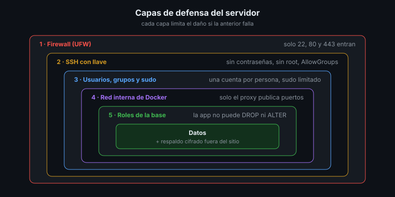
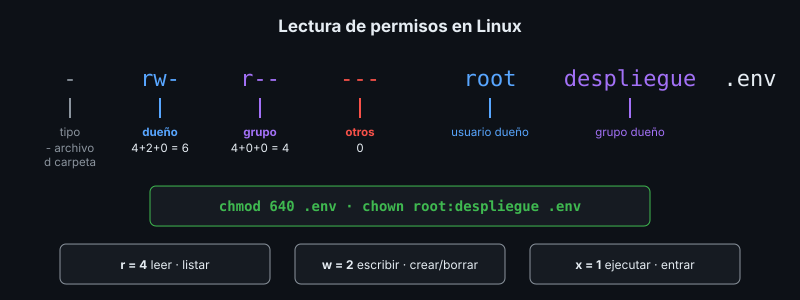

# Usuarios, Grupos y Permisos en Linux

## 🎯 Objetivos

- Diferenciar usuarios de personas, usuarios de servicio y el superusuario `root`
- Leer y asignar permisos con `chmod` y `chown`
- Organizar el acceso a una carpeta de despliegue con grupos
- Delegar privilegios con `sudo` aplicando mínimo privilegio

## 📋 Contenido

### 1. Mínimo privilegio

Cada persona y cada proceso recibe **solo** los permisos que necesita para su tarea, y nada más.
Si una cuenta se ve comprometida, el daño queda limitado a lo que esa cuenta podía hacer.



Ninguna capa es suficiente sola: si una falla, la siguiente contiene el daño (*defensa en
profundidad*).

### 2. Tipos de cuenta

| Tipo | Ejemplo | Inicia sesión | Uso |
|---|---|:---:|---|
| Superusuario | `root` (UID 0) | ❌ por SSH | Nadie lo usa directamente: se llega con `sudo` |
| Persona administradora | `ana` (grupo `sudo`) | ✅ con llave | Instala, actualiza, configura |
| Persona operadora | `luis` (grupo `despliegue`) | ✅ con llave | Despliega y reinicia la app, nada más |
| Servicio | `respaldo`, `postgres` | ❌ `nologin` | Ejecuta un proceso: cron, base de datos |

Una cuenta **por persona**, nunca compartida: así los registros dicen *quién* hizo cada cosa.

```bash
sudo adduser ana                                  # persona (pide contraseña para sudo)
sudo usermod -aG sudo ana                         # -a agrega sin quitar otros grupos
sudo useradd --system --create-home --home-dir /var/lib/respaldo \
     --shell /usr/sbin/nologin respaldo           # servicio: sin sesión interactiva
id ana                                            # UID, grupo principal y grupos
```

⚠️ `usermod -G` **sin** `-a` reemplaza todos los grupos del usuario.

### 3. Permisos



| Símbolo | Archivo | Carpeta | Valor |
|---|---|---|:---:|
| `r` | Leer el contenido | Listar los nombres | 4 |
| `w` | Modificar | Crear y borrar archivos dentro | 2 |
| `x` | Ejecutar | Entrar (`cd`) y acceder a lo de adentro | 1 |

Se suman por grupo de tres (dueño, grupo, otros): `640` = `rw-` `r--` `---`.

| Archivo típico | Permisos | Por qué |
|---|:---:|---|
| `.env` con secretos | `600` o `640` | Solo el dueño (y su grupo) lo leen |
| Llave privada SSH | `600` | SSH se niega a usarla si otros pueden leerla |
| Script ejecutable | `755` | Todos lo ejecutan, solo el dueño lo cambia |
| Carpeta de despliegue | `2770` | Solo el grupo entra; lo nuevo hereda el grupo |

```bash
sudo chown root:despliegue /opt/biblioteca/.env
sudo chmod 640 /opt/biblioteca/.env
ls -l /opt/biblioteca/.env        # -rw-r----- 1 root despliegue ...
```

### 4. Carpetas compartidas por un grupo

El bit **setgid** en una carpeta (el `2` inicial de `2770`, la `s` en `drwxrws---`) hace que todo
archivo creado adentro pertenezca al grupo de la carpeta, no al grupo personal de quien lo creó.
Sin él, cada integrante crea archivos que los demás no pueden modificar.

```bash
sudo install -d -o root -g despliegue -m 2770 /opt/biblioteca
```

### 5. `sudo`: privilegio prestado y registrado

`sudo` ejecuta **un** comando como otro usuario (normalmente `root`) y lo deja en el registro
(`/var/log/auth.log`). Se configura con archivos en `/etc/sudoers.d/`, siempre validados:

```bash
echo '%despliegue ALL=(root) NOPASSWD: /usr/local/bin/reiniciar-biblioteca' \
  | sudo tee /etc/sudoers.d/despliegue
sudo chmod 440 /etc/sudoers.d/despliegue
sudo visudo -cf /etc/sudoers.d/despliegue          # un error de sintaxis bloquea sudo
sudo -l -U luis                                    # qué puede hacer luis
```

| Regla | Riesgo |
|---|---|
| `luis ALL=(ALL) ALL` | Luis es administrador: no es mínimo privilegio |
| `luis ALL=(root) NOPASSWD: /usr/bin/docker *` | Equivale a `root`: `docker run -v /:/host` lee todo el disco |
| `%despliegue ... /usr/local/bin/reiniciar-biblioteca` | ✅ Un solo comando, con ruta completa y sin argumentos libres |

⚠️ Pertenecer al grupo `docker` también equivale a ser `root`. Solo los administradores lo tienen.

### 6. Aplicación al proyecto real

Haz la lista de personas y servicios que tocan el servidor de tu proyecto: qué cuenta tiene cada
uno, a qué grupos pertenece y qué comandos puede ejecutar con `sudo`. Será la primera parte de
tu matriz de usuarios.

## 📚 Recursos Adicionales

Ver [`4-recursos/webgrafia/`](../4-recursos/webgrafia/README.md).
