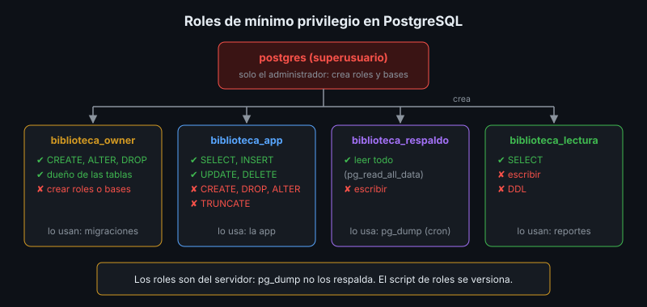

# Roles y Privilegios en la Base de Datos

## 🎯 Objetivos

- Explicar por qué la app no debe conectarse como superusuario
- Diseñar roles separados para dueño, aplicación, respaldo y consulta
- Otorgar y revocar privilegios con `GRANT`, `REVOKE` y `ALTER DEFAULT PRIVILEGES`
- Validar los privilegios con pruebas que **deben fallar**

## 📋 Contenido

### 1. El problema

En la imagen oficial de PostgreSQL, `POSTGRES_USER` es **superusuario**. Si la app se conecta
con él, una inyección SQL o un error de código puede:

- borrar tablas o la base completa (`DROP`),
- crear usuarios o cambiar contraseñas (`ALTER ROLE`),
- leer y escribir archivos del servidor (`COPY ... TO PROGRAM` ejecuta comandos del sistema).

El superusuario es para **administrar**, como `root` en Linux. Nadie lo usa en el día a día.

### 2. Roles

En PostgreSQL, usuarios y grupos son lo mismo: **roles**. Un rol con `LOGIN` puede conectarse;
un rol sin `LOGIN` sirve como grupo de permisos.



| Rol | Puede | No puede | Lo usa |
|---|---|---|---|
| `postgres` (superusuario) | Todo | — | El administrador, solo para crear roles y bases |
| `biblioteca_owner` | Crear, alterar y borrar **sus** tablas | Tocar otras bases, crear roles | Las migraciones |
| `biblioteca_app` | `SELECT`, `INSERT`, `UPDATE`, `DELETE` | `CREATE`, `DROP`, `ALTER`, `TRUNCATE` | La app en ejecución |
| `biblioteca_respaldo` | Leer todo (`pg_read_all_data`) | Escribir | `pg_dump` desde cron |
| `biblioteca_lectura` | `SELECT` en tablas de consulta | Escribir | Reportes, analistas |

### 3. Privilegios

```sql
-- Nadie se conecta si no se le nombra
REVOKE ALL ON DATABASE biblioteca FROM PUBLIC;
GRANT CONNECT ON DATABASE biblioteca TO biblioteca_app;

-- La app usa el esquema y manipula filas
GRANT USAGE ON SCHEMA public TO biblioteca_app;
GRANT SELECT, INSERT, UPDATE, DELETE ON ALL TABLES IN SCHEMA public TO biblioteca_app;
GRANT USAGE ON ALL SEQUENCES IN SCHEMA public TO biblioteca_app;   -- para SERIAL
```

| Nivel | Privilegios habituales |
|---|---|
| Base de datos | `CONNECT`, `CREATE` (esquemas), `TEMPORARY` |
| Esquema | `USAGE` (ver lo que hay), `CREATE` (crear tablas) |
| Tabla | `SELECT`, `INSERT`, `UPDATE`, `DELETE`, `TRUNCATE`, `REFERENCES` |
| Secuencia | `USAGE` (obtener el siguiente valor), `SELECT` |

Borrar o alterar una tabla no es un privilegio que se otorga: solo lo puede hacer su **dueño**.
Por eso las tablas pertenecen a `biblioteca_owner` y no a la app.

### 4. Tablas futuras

`GRANT ... ON ALL TABLES` aplica a las tablas que existen **hoy**. Para las que cree una
migración mañana:

```sql
ALTER DEFAULT PRIVILEGES FOR ROLE biblioteca_owner IN SCHEMA public
    GRANT SELECT, INSERT, UPDATE, DELETE ON TABLES TO biblioteca_app;
```

Sin esto, la app falla con `permission denied` en cuanto se despliega una tabla nueva.

### 5. Migraciones con otro rol

Si la app solo manipula filas, no puede aplicar migraciones. Se separan en un paso propio del
despliegue, con el rol dueño:

```bash
docker compose run --rm -e DATABASE_URL=<url del dueño> app python -m app.main
docker compose up -d app          # la app arranca con su rol limitado
```

Si la app arranca con migraciones pendientes, falla con `permission denied`: es un fallo
**rápido y visible**, mejor que un esquema a medio aplicar.

### 6. Roles y respaldos

Los roles pertenecen al **servidor**, no a la base: `pg_dump` guarda los dueños y permisos de
las tablas, pero **no crea los roles**. Por eso el script de roles se versiona y se ejecuta al
reconstruir un servidor, **antes** de restaurar. Los permisos a nivel de base (`CONNECT`) tampoco
viajan en el volcado.

### 7. Validar con pruebas negativas

Un privilegio no se da por bueno hasta ver fallar lo que debe fallar:

| Prueba con `biblioteca_app` | Resultado esperado |
|---|---|
| `SELECT`, `INSERT` en `libros` | ✅ Funciona |
| `DROP TABLE libros;` | ❌ `must be owner of table libros` |
| `TRUNCATE libros;` | ❌ `permission denied for table libros` |
| `CREATE TABLE x (i int);` | ❌ `permission denied for schema public` |
| Conectarse a la base `postgres` | ❌ `permission denied for database "postgres"` |

Las pruebas se hacen **por la red**, como se conecta la app. `pg_hba.conf` decide cómo se
autentica cada conexión, y la imagen oficial confía (`trust`) en las que nacen dentro del propio
contenedor: desde allí cualquier contraseña funciona.

### 8. En la nube

Neon y Supabase no entregan un superusuario real, pero el rol por defecto sí es dueño de todo.
Crea un rol aparte para la app con el mismo esquema de permisos.

### 9. Aplicación al proyecto real

Diseña los roles de la base de tu proyecto, con sus privilegios y quién usa cada uno, y escribe
las pruebas negativas que los validan.

## 📚 Recursos Adicionales

Ver [`4-recursos/webgrafia/`](../4-recursos/webgrafia/README.md).
