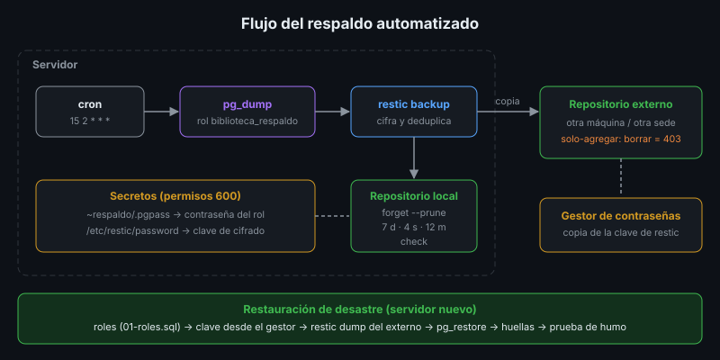

# Respaldo Automatizado y Cifrado

## 🎯 Objetivos

- Pasar del plan de respaldo v0 (semana 2) a un respaldo automático, cifrado y fuera del sitio
- Usar restic: repositorio, instantáneas, retención y verificación
- Programar el respaldo con cron y revisar su resultado
- Probar la restauración completa y medirla contra el RTO

## 📋 Contenido

### 1. Del plan v0 al plan final

| Semana 2 (v0) | Semana 6 (final) |
|---|---|
| `pg_dump` manual a una carpeta | Script ejecutado por cron, con un usuario y un rol de solo lectura |
| Archivo `.dump` legible por quien tenga el disco | Cifrado con restic |
| Retención con `ls \| tail \| rm` | Política `forget` diaria/semanal/mensual |
| Una copia en el mismo servidor | Copia local + copia fuera del sitio, solo-agregar (3-2-1-1) |
| Restauración en una base de prueba | Restauración de desastre: servidor nuevo, roles, datos, huellas |

### 2. restic

restic es una herramienta de respaldo de código abierto que **cifra** (AES-256), **deduplica**
(un bloque repetido se guarda una vez) y guarda **instantáneas** (*snapshots*) en un
**repositorio**: una carpeta local, un servidor SFTP, un servidor REST o almacenamiento de objetos
compatible con S3.



```bash
export RESTIC_PASSWORD_FILE=/etc/restic/password
restic -r /var/respaldos/restic init                     # una vez
pg_dump -Fc biblioteca > /tmp/b.dump
restic -r /var/respaldos/restic backup --tag db \
       --stdin --stdin-filename biblioteca.dump < /tmp/b.dump
restic -r /var/respaldos/restic snapshots                # listar
restic -r /var/respaldos/restic dump latest biblioteca.dump > restaurado.dump
```

⚠️ **Sin la contraseña no hay respaldo.** restic no tiene "recuperar contraseña". Se guarda en el
servidor (para cron) **y** en el gestor de contraseñas del equipo (para el día en que el servidor
ya no exista).

### 3. Retención

```bash
restic -r /var/respaldos/restic forget --tag db \
       --keep-daily 7 --keep-weekly 4 --keep-monthly 12 --prune
```

`forget` decide qué instantáneas conservar (el esquema GFS de la semana 2); `--prune` libera el
espacio de lo que ya nadie usa. restic agrupa las instantáneas por equipo y ruta: por eso el
volcado se entrega siempre con el **mismo nombre** (`--stdin-filename`). Con nombres distintos,
cada respaldo sería un grupo propio y la retención no borraría nada.

### 4. La copia fuera del sitio, solo-agregar

Si un atacante (o un error) llega al servidor con los permisos del usuario `respaldo`, podría
borrar también los respaldos. Un repositorio **solo-agregar** (*append-only*) acepta respaldos
nuevos pero rechaza borrar (`403 Forbidden`): es la copia "inmutable" de la regla 3-2-1-1-0. La
retención de ese repositorio la aplica su administrador desde otro equipo.

| Destino fuera del sitio | Costo |
|---|---|
| `rest-server` de restic en otra máquina (`--append-only`) | Gratis, necesita otra máquina |
| Otro servidor por SFTP | Gratis, sin modo solo-agregar |
| Almacenamiento de objetos (S3 compatible) | Planes gratuitos limitados; bloqueo de objetos en algunos |

### 5. cron

```
# /etc/cron.d/respaldo-biblioteca
# m  h  dom mes dow  usuario   comando
 15  2  *   *   *    respaldo  /opt/respaldo/respaldar.sh >> /var/log/respaldo/respaldo.log 2>&1
```

| Cuidado | Por qué |
|---|---|
| Rutas completas y variables definidas en el script | cron arranca con un `PATH` mínimo y sin tu `.bashrc` |
| Redirigir la salida a un log | Si no, el resultado se pierde |
| `set -euo pipefail` en el script | Un paso fallido detiene todo y deja el error en el log |
| Hora de poco uso | El volcado consume disco y CPU |
| Avisar si falla | Un respaldo que falla en silencio es peor que ninguno: monitoreo en la semana 7 |

Herramienta de ayuda para leer expresiones: `crontab.guru`.

### 6. Verificar y restaurar

- `restic check`: la estructura del repositorio está completa. Con `--read-data-subset=10%`
  además relee una parte de los datos.
- **Restauración de prueba**: la única verificación que cuenta. Como mínimo una vez al mes y
  después de cada cambio en el procedimiento. Se mide el tiempo y se compara con el RTO.

Procedimiento de desastre (servidor nuevo):

1. Instalar el servidor y la app sin datos (plan de instalación).
2. Crear los roles de la base (`01-roles.sql`): el volcado no los trae.
3. Recuperar la contraseña de restic desde el gestor de contraseñas.
4. `restic dump latest` desde la copia **fuera del sitio** y `pg_restore`.
5. Validar con huellas (semana 5) y prueba de humo.

### 7. Aplicación al proyecto real

Actualiza el plan de respaldo de la semana 2 con: script, usuario y rol que lo ejecutan, cifrado,
dónde vive la contraseña, repositorios local y externo, retención, horario de cron y la
restauración de desastre probada con su tiempo medido.

## 📚 Recursos Adicionales

Ver [`4-recursos/webgrafia/`](../4-recursos/webgrafia/README.md).
