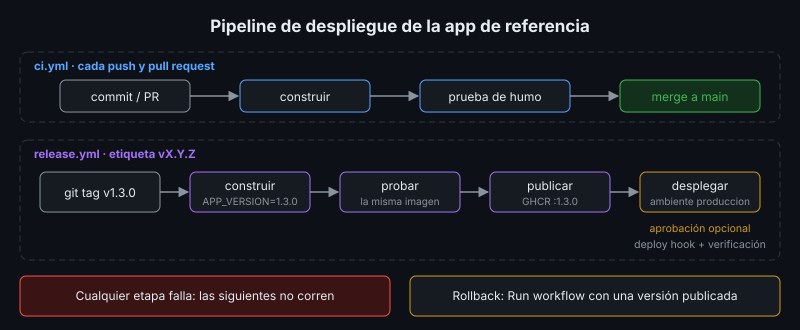

# CI/CD Orientado al Despliegue

## 🎯 Objetivos

- Diferenciar integración continua, entrega continua y despliegue continuo
- Identificar las etapas de un pipeline de despliegue y lo que produce cada una
- Aplicar el principio de "construir una vez, desplegar muchas"
- Ubicar los secretos y las aprobaciones dentro del pipeline

## 📋 Contenido

### 1. Del procedimiento manual al pipeline

En las semanas 4 a 6 desplegaste a mano: construir, etiquetar, probar, copiar, respaldar,
migrar, cambiar, verificar. Cada paso manual es una oportunidad de olvidar algo. Un **pipeline**
es ese mismo procedimiento escrito como código y ejecutado por una máquina, siempre igual.

| Término | Qué automatiza | Cuándo corre |
|---|---|---|
| **Integración continua (CI)** | Construir y probar cada cambio | En cada *push* y *pull request* |
| **Entrega continua** | Dejar una versión lista para desplegar (imagen publicada) | Al liberar una versión |
| **Despliegue continuo** | Llevar esa versión a producción sin intervención humana | Después de la entrega, si todo pasa |

La diferencia entre entrega y despliegue continuo es **quién aprieta el botón final**: una
persona o el pipeline.

### 2. Etapas

| Etapa | Entrada | Salida | Si falla |
|---|---|---|---|
| Construir | Código de una etiqueta `vX.Y.Z` | Imagen `biblioteca:X.Y.Z` | Se detiene: no hay versión |
| Probar | La imagen construida | Prueba de humo en verde | Se detiene: la imagen no se publica |
| Publicar | Imagen probada | Imagen en el registro (GHCR) | Se detiene |
| Desplegar | Versión publicada | Servicio con la versión nueva | Rollback (teoría 03) |
| Verificar | URL de producción | Prueba de humo contra producción | Alerta y rollback |

Cada etapa es una **compuerta**: si falla, las siguientes no corren.

### 3. Construir una vez, desplegar muchas

La imagen que pasó las pruebas es **exactamente** la que llega a producción: no se reconstruye
por ambiente (semana 4). Lo que cambia entre ambientes es la configuración (semana 5), que el
pipeline no mete en la imagen.

| ❌ Antipatrón | ✅ Práctica |
|---|---|
| Construir en el servidor de producción | Construir en el pipeline y publicar en un registro |
| Etiqueta `latest` | Etiqueta de versión inmutable, igual a la etiqueta Git |
| Probar una imagen y desplegar otra | Probar y publicar la misma imagen |
| Contraseñas en el workflow | Secretos del repositorio o del ambiente |

### 4. Qué se prueba en un pipeline de despliegue

Este bootcamp no enseña a escribir pruebas unitarias; se enfoca en las pruebas que protegen el
**despliegue**:

- La imagen **construye** (dependencias fijadas, Dockerfile correcto).
- La app **arranca** con su base y aplica sus migraciones.
- La **prueba de humo** pasa contra el contenedor recién construido.
- Después de desplegar, la **versión** que responde en producción es la esperada.

Si el proyecto tiene pruebas unitarias, van en la etapa "Probar", antes de publicar.

### 5. Secretos y aprobaciones

- El pipeline necesita credenciales (registro, deploy hook, SSH). Se guardan como **secretos**
  del repositorio o del **ambiente**, nunca en el archivo del workflow (semana 6).
- Un **ambiente** (*environment*) agrupa los secretos de producción y puede exigir la
  **aprobación** de una persona antes de desplegar: así la entrega continua no se vuelve
  despliegue continuo sin querer.
- Solo el pipeline de la rama principal o de etiquetas llega a producción; un *pull request* de
  un desconocido no debe poder leer esos secretos.

### 6. Beneficios medibles

| Indicador | Qué mide |
|---|---|
| Frecuencia de despliegue | Cuántas veces se despliega por semana |
| Tiempo de entrega | Desde el *commit* hasta producción |
| Tasa de fallos por cambio | Qué porcentaje de despliegues requiere rollback |
| Tiempo de recuperación | Cuánto tarda volver a un estado sano |

Son los cuatro indicadores DORA. Un pipeline confiable mejora los cuatro a la vez.

### 7. Aplicación al proyecto real

Dibuja el pipeline de tu proyecto con sus etapas, qué produce cada una, dónde se guardan los
secretos y quién aprueba el paso a producción.

## 📚 Recursos Adicionales

Ver [`4-recursos/webgrafia/`](../4-recursos/webgrafia/README.md).
