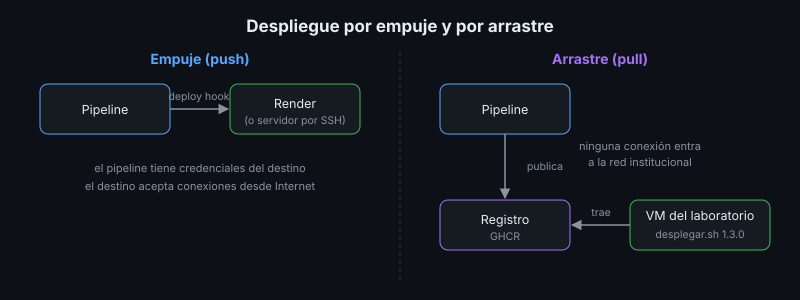
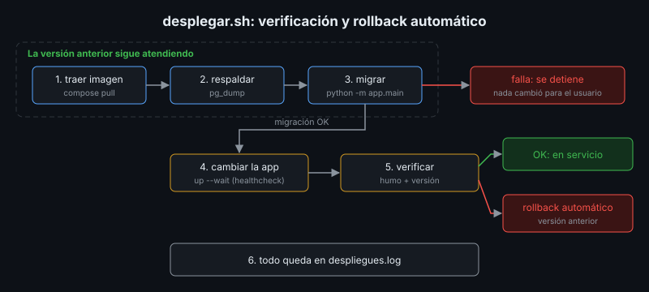

# Estrategias de Despliegue y Rollback

## 🎯 Objetivos

- Diferenciar el despliegue por empuje (*push*) y por arrastre (*pull*)
- Reconocer las estrategias de despliegue y sus costos
- Automatizar un despliegue con verificación y rollback automático
- Escribir migraciones que permitan volver a la versión anterior

## 📋 Contenido

### 1. ¿Quién inicia el despliegue?

| | Empuje (*push*) | Arrastre (*pull*) |
|---|---|---|
| Quién actúa | El pipeline se conecta al destino | El servidor trae la versión del registro |
| Ejemplo | GitHub Actions llama al deploy hook de Render; o entra por SSH | `desplegar.sh 1.2.0` en el servidor (a mano, por cron o por un agente) |
| El pipeline necesita | Credenciales del destino | Nada del servidor: solo publicar en el registro |
| El servidor necesita | Aceptar conexiones del pipeline | Salida a Internet hacia el registro |
| Apto para | PaaS, servidores alcanzables desde Internet | Servidores en redes cerradas, como la VM Ubuntu del laboratorio |

Una red institucional normalmente **no** deja entrar conexiones desde GitHub. Por eso el
servidor del laboratorio usa arrastre: el pipeline publica, el servidor despliega.

### 2. Estrategias

| Estrategia | Cómo funciona | Tiempo sin servicio | Costo |
|---|---|---|---|
| **Recrear** | Se detiene la versión vieja y se arranca la nueva | Segundos | Mínimo: la que usa `docker compose up` |
| **Rolling** | Se reemplazan las réplicas de a una | Ninguno | Requiere varias réplicas |
| **Azul-verde** | Dos ambientes completos; se cambia el tráfico de uno al otro | Ninguno, rollback instantáneo | El doble de infraestructura |
| **Canary** | La versión nueva recibe un porcentaje pequeño del tráfico | Ninguno | Balanceador y métricas finas |

Render hace un reemplazo sin corte: arranca la versión nueva, espera su `healthCheckPath` y solo
entonces le pasa el tráfico. En el servidor propio se usa "recrear", aceptando unos segundos de
corte (se anuncia en la ventana de mantenimiento).

### 3. Un despliegue que se verifica solo

[`referencia/deploy/desplegar.sh`](../../../referencia/deploy/desplegar.sh) es el procedimiento de
la semana 4 más lo aprendido en las semanas 5 y 6:

1. **Traer** la imagen del registro. Si la versión no existe, se detiene sin tocar nada.
2. **Respaldar** la base (semana 2).
3. **Migrar** con la versión nueva, mientras la anterior sigue atendiendo; con el rol dueño si
   está configurado (semana 6). Si una migración falla, se detiene: la anterior sigue en servicio.
4. **Cambiar** la app a la versión nueva y esperar su healthcheck (semana 5).
5. **Verificar** con la prueba de humo y la versión reportada. Si falla: **rollback automático**
   a la versión anterior.
6. **Registrar** cada paso en `despliegues.log`.

### 4. Rollback

| Dónde | Cómo | Qué vuelve atrás |
|---|---|---|
| Render | Panel → *Rollback* a un despliegue anterior, o `release.yml` a mano con la versión anterior | La imagen |
| Servidor | `bash desplegar.sh <versión anterior>` | La imagen |
| Base de datos | Restaurar el respaldo tomado antes del despliegue | **Los datos**, incluidos los que llegaron después |

El rollback de la imagen es rápido; el de la base pierde datos. Por eso las migraciones se
diseñan para no necesitarlo.

### 5. Migraciones compatibles hacia atrás

Durante el paso 3 la versión **anterior** corre sobre el esquema **nuevo**, y después de un
rollback también. Regla: **expandir primero, contraer después** (*expand/contract*).

| Cambio | ❌ En un solo despliegue | ✅ En dos despliegues |
|---|---|---|
| Renombrar una columna | `RENAME COLUMN` rompe la versión anterior | 1) agregar la nueva y copiar datos; 2) cuando nadie use la vieja, borrarla |
| Borrar una columna | La versión anterior falla al leerla | 1) dejar de usarla en el código; 2) borrarla en la versión siguiente |
| Columna obligatoria nueva | `NOT NULL` sin valor rompe los `INSERT` viejos | Agregarla con `DEFAULT` o como opcional |

La migración `002` de la semana 4 (un índice) cumple la regla: por eso ese rollback funcionó sin
tocar la base.

### 6. Ventana, comunicación y registro

Aunque el despliegue sea automático, se sigue comunicando: qué versión, cuándo, cuánto corte se
espera y cómo se vuelve atrás. El registro de despliegues responde "¿qué cambió?" cuando algo
falla a las 3 a. m.

### 7. Aplicación al proyecto real

Decide empuje o arrastre para cada destino de tu proyecto, la estrategia de despliegue, cómo se
hace el rollback y qué migraciones de tu historial no serían compatibles hacia atrás.

## 📚 Recursos Adicionales

Ver [`4-recursos/webgrafia/`](../4-recursos/webgrafia/README.md).
