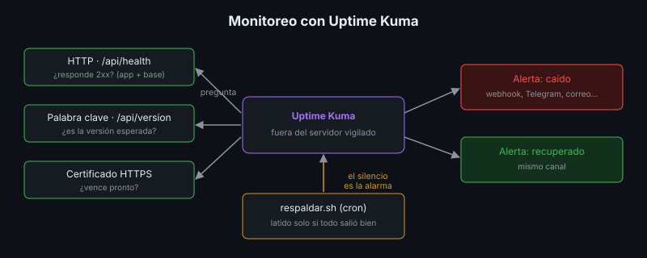

# Monitoreo Básico

## 🎯 Objetivos

- Decidir qué monitorear en un software implantado
- Configurar monitores de disponibilidad, de contenido y de latido con Uptime Kuma
- Diseñar alertas útiles, sin ruido
- Usar los logs y las métricas del servidor para diagnosticar

## 📋 Contenido

### 1. ¿Para qué monitorear?

El healthcheck de la semana 5 **informa** el estado, pero nadie lo mira y Docker no reacciona a
`unhealthy`. El monitoreo cierra el ciclo: **detecta** el problema y **avisa** a una persona
antes que los usuarios.

| Qué | Pregunta | Cómo |
|---|---|---|
| Disponibilidad | ¿Responde? | Monitor HTTP a `/api/health` |
| Contenido | ¿Responde lo correcto? | Monitor de palabra clave: la versión esperada en `/api/version` |
| Latencia | ¿Responde a tiempo? | Tiempo de respuesta de cada verificación |
| Certificado | ¿Vence pronto el HTTPS? | Aviso de expiración del certificado |
| Tareas programadas | ¿Corrió el respaldo? | Monitor de latido (*push*) |
| Recursos | ¿Hay disco, memoria? | `df -h`, `docker stats` (y en la semana 8, alertas de disco) |

### 2. Por fuera y por dentro

- **Caja negra**: se prueba desde afuera, como un usuario (Uptime Kuma, la prueba de humo).
  Responde "¿funciona?".
- **Caja blanca**: se mira por dentro (logs, métricas del proceso y de la base). Responde "¿por
  qué no funciona?".

Un monitor de caja negra corre **fuera** del servidor que vigila: si el servidor se cae, un
monitor instalado en él se cae con él.

### 3. Uptime Kuma

Herramienta de código abierto para monitorear disponibilidad, con panel web, historial, páginas
de estado y más de 90 tipos de notificación (correo, Telegram, Discord, Slack, webhook…).



| Tipo de monitor | Qué hace | Uso en la app de referencia |
|---|---|---|
| HTTP(s) | Pide una URL y espera un código 2xx | `/api/health` |
| Palabra clave | Además busca un texto en la respuesta | La versión en `/api/version` |
| TCP | Abre un puerto | Que la base **no** responda desde afuera |
| Push (latido) | Espera que **alguien** lo llame cada cierto tiempo | El respaldo de cron llama al terminar bien |

El monitor de latido invierte la lógica: el silencio es la alarma. Si el respaldo falla, se
cuelga o cron deja de correrlo, no llega el latido y Uptime Kuma avisa. Resuelve el problema de
la semana 6: "un respaldo que falla en silencio es peor que ninguno".

```bash
# al final de respaldar.sh, solo si todo salió bien:
curl -fsS -m 10 --retry 3 "https://monitor.ejemplo.com/api/push/<token>?status=up&msg=OK" > /dev/null
```

### 4. Alertas útiles

| Regla | Por qué |
|---|---|
| Alertar por síntomas que afectan usuarios | "La app no responde" sí; "CPU al 70 %" casi nunca |
| Reintentos antes de alertar | Un fallo aislado de red no debe despertar a nadie |
| Alerta de recuperación | Saber que se resolvió sin tener que revisar |
| Un canal que alguien lea | Una alerta en un correo que nadie abre no existe |
| Cada alerta con una acción | Si nadie sabe qué hacer al recibirla, sobra |

Demasiadas alertas producen **fatiga**: el equipo aprende a ignorarlas y pierde la importante.

### 5. Logs

```bash
docker compose logs --since 30m app            # lo reciente
docker compose logs app | grep -iE "error|traceback"
docker compose logs -f app                     # en vivo, mientras se prueba
docker stats --no-stream                       # CPU y memoria por contenedor
docker system df                               # espacio que ocupa Docker
df -h /                                        # disco del servidor
```

Con rotación (semana 5), los logs de Docker sirven para días, no para meses. Guardar logs a
largo plazo o buscarlos entre varios servidores requiere una plataforma de logs (Loki, Graylog,
servicios en la nube): fuera del alcance de este bootcamp.

### 6. Dónde corre el monitor

| Opción | Costo | Ventaja |
|---|---|---|
| Uptime Kuma en **otra** máquina del laboratorio | Gratis | Control total, ve la red interna |
| Uptime Kuma en una VM gratuita de la nube | Gratis con límites | Ve el servicio como un usuario de Internet |
| Servicio de monitoreo con plan gratuito | Gratis con límites | Nada que mantener |

Para una app en Render, un monitor externo cada pocos minutos también evita que el plan gratuito
la suspenda por inactividad (revisa si las condiciones del proveedor lo permiten).

### 7. Aplicación al proyecto real

Define los monitores de tu proyecto, su intervalo y reintentos, quién recibe las alertas y por
qué canal, y qué hace esa persona al recibir cada una.

## 📚 Recursos Adicionales

Ver [`4-recursos/webgrafia/`](../4-recursos/webgrafia/README.md).
