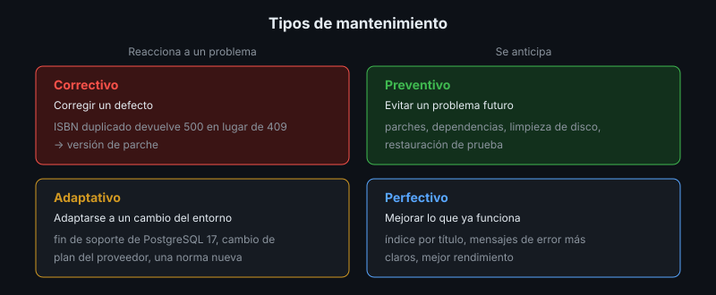

# Plan de Mantenimiento

## 🎯 Objetivos

- Diferenciar los tipos de mantenimiento del software
- Identificar qué envejece en un software implantado y a qué ritmo
- Elaborar un calendario de tareas de mantenimiento con responsables
- Controlar el fin de soporte (EOL) de cada componente

## 📋 Contenido

### 1. El software implantado envejece

Aunque nadie toque el código, el software se degrada: aparecen vulnerabilidades en sus
dependencias, el sistema operativo deja de recibir parches, el disco se llena, un certificado
vence, cambia una ley o el proveedor de la nube cambia su plan gratuito. El mantenimiento es lo
que se hace **después** de implantar para que el software siga sirviendo.

### 2. Tipos de mantenimiento

| Tipo | Motivo | Ejemplo en la app de referencia |
|---|---|---|
| **Correctivo** | Corregir un defecto | El ISBN duplicado devuelve 500 en lugar de 409 |
| **Preventivo** | Evitar un problema futuro | Actualizar dependencias, parches del SO, limpiar imágenes viejas |
| **Adaptativo** | Adaptarse a un cambio del entorno | Migrar de PostgreSQL 17 a 18; el PaaS cambia sus condiciones |
| **Perfectivo** | Mejorar lo que ya funciona | Índice para búsquedas por título, mejor mensaje de error |

El correctivo es el más visible, pero el preventivo es el más barato: cada actualización pequeña
aplazada se convierte en una migración grande y riesgosa.

### 3. Qué envejece y cada cuánto se revisa

| Componente | Riesgo | Tarea | Frecuencia sugerida |
|---|---|---|---|
| Paquetes del SO | Vulnerabilidades | Actualizaciones de seguridad automáticas + revisión | Diaria (automática), semanal (revisión) |
| Kernel y bibliotecas base | Parches que exigen reinicio | Reinicio planificado | Mensual, en ventana |
| Dependencias de la app | Vulnerabilidades, versiones abandonadas | Dependabot + auditoría | Semanal |
| Imágenes base (Docker) | Vulnerabilidades del SO de la imagen | Reconstruir y liberar una versión de parche | Mensual o ante una alerta |
| Base de datos | Parches menores; fin de soporte de la versión mayor | Actualización menor; planear la mayor | Trimestral |
| Disco, logs, imágenes viejas | Disco lleno | `revisar-servidor`, `docker image prune` | Diaria (automática) |
| Respaldos | Respaldos que no restauran | Restauración de prueba (semana 6) | Mensual |
| Secretos y accesos | Personas que ya no están | Revisar cuentas, llaves y rotar secretos | Trimestral y al salir alguien |
| Certificados y dominio | Vencimiento | Monitor de certificado (semana 7), renovación del dominio | Automático + anual |
| Documentación y ayudas | Quedan desactualizadas | Revisar al liberar cada versión | En cada versión |

### 4. Fin de soporte (EOL)

Cada componente tiene una fecha a partir de la cual su fabricante deja de publicar parches. Pasada
esa fecha, cada vulnerabilidad nueva queda abierta para siempre.

| Componente | Versión en la app de referencia | Dónde consultar |
|---|---|---|
| Ubuntu Server | 24.04 LTS | endoflife.date/ubuntu |
| PostgreSQL | 17 | endoflife.date/postgresql |
| Python | 3.13 | endoflife.date/python |
| Node.js (solo para construir) | 22 LTS | endoflife.date/nodejs |

La tabla de EOL del proyecto dice cuándo hay que planear un mantenimiento **adaptativo** antes de
que sea urgente.

### 5. Ventanas de mantenimiento

Las tareas que interrumpen el servicio (reinicios, actualizaciones mayores, migraciones) se hacen
en una **ventana** acordada con el cliente: día y hora de poco uso, duración máxima, aviso previo
a los usuarios y plan de reversa. Lo que no interrumpe (actualizar dependencias por el pipeline,
revisar logs) se hace en cualquier momento.

### 6. Registro

Cada mantenimiento deja rastro: fecha, qué se hizo, quién, resultado y, si falló, cómo se
revirtió. El registro de despliegues de la semana 7 y los *pull requests* de Dependabot ya son
parte de ese registro.

### 7. Aplicación al proyecto real

Elabora el calendario de mantenimiento de tu proyecto con la tabla de la sección 3, su tabla de
EOL y la ventana de mantenimiento que propondrías al cliente.

## 📚 Recursos Adicionales

Ver [`4-recursos/webgrafia/`](../4-recursos/webgrafia/README.md).
