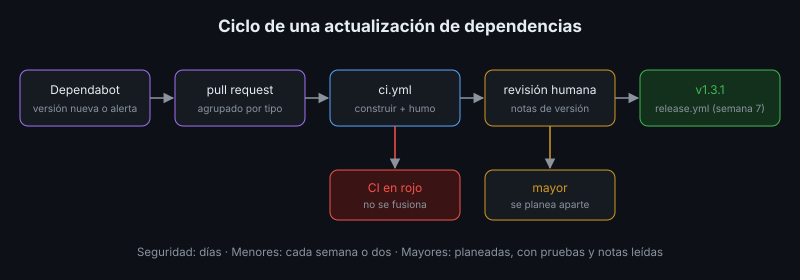

# Actualizaciones de Dependencias, Imágenes y Sistema Operativo

## 🎯 Objetivos

- Automatizar la detección de actualizaciones con Dependabot
- Auditar dependencias e imágenes en busca de vulnerabilidades conocidas
- Configurar las actualizaciones automáticas de seguridad de Ubuntu
- Decidir qué actualizar de inmediato y qué planear

## 📋 Contenido

### 1. Versiones fijadas

La app de referencia fija **todas** sus versiones: `requirements.txt` (generado por `pip-compile`
desde `requirements.in`), `package-lock.json` y las etiquetas de las imágenes base. Eso hace
reproducible cada construcción (semana 4), pero significa que nada se actualiza solo: alguien
tiene que proponer el cambio, probarlo y liberarlo.

### 2. Dependabot

Dependabot es un servicio de GitHub que revisa las dependencias y abre *pull requests* con las
versiones nuevas. Se configura en `.github/dependabot.yml`:



| Ecosistema | Archivos que actualiza en la app de referencia |
|---|---|
| `pip` | `api/requirements.txt` |
| `npm` | `web/package.json` y `package-lock.json` |
| `docker` | `FROM` del `Dockerfile` |
| `github-actions` | `uses:` de los workflows |

- **Actualizaciones de versión**: según el horario (`schedule`). Con `groups`, las menores y
  de parche llegan juntas en un solo *pull request*.
- **Actualizaciones de seguridad**: apenas se publica una alerta que afecta al proyecto, sin
  esperar el horario (se activan en *Settings → Code security*).

Cada *pull request* de Dependabot pasa por `ci.yml` (semana 7). Si la prueba de humo está en
verde, se fusiona y se libera una versión de parche con el pipeline.

Dos lecciones de probar el `dependabot.yml` de la app de referencia:

- Dependabot propuso por separado `vite` 8 y `@vitejs/plugin-react` 6. El segundo **exige** el
  primero: su *pull request* falló en CI con `ERESOLVE`. Agruparlos no bastó (Dependabot dejó el
  plugin aparte). Lo que funcionó fue el **orden**: fusionar `vite`, comentar
  `@dependabot rebase` en el *pull request* del plugin y esperar el CI en verde.
- Propuso `node:26-alpine`, una versión que aún no es LTS. Los saltos mayores de Node se ignoran
  y se deciden a mano.

Alternativa de código abierto con más opciones: **Renovate** (funciona también con GitLab).

### 3. ¿Qué tan rápido actualizar?

| Actualización | Riesgo | Decisión habitual |
|---|---|---|
| Parche de seguridad (`1.4.2` → `1.4.3`) | Bajo | Fusionar en días si el CI pasa |
| Menor (`1.4` → `1.5`) | Bajo a medio | Agrupar y fusionar semanal o quincenal |
| Mayor (`1.x` → `2.0`) | Alto: cambios incompatibles | Leer las notas de versión, planear, probar a fondo |
| Imagen base (`python:3.13` → `3.14`) | Medio | Tratar como mayor: cambia el intérprete |

Un *pull request* de Dependabot sin atender durante meses es deuda: cuanto más se acumula, más
difícil es el salto.

### 4. Auditar vulnerabilidades

| Herramienta | Qué revisa | Comando |
|---|---|---|
| `pip-audit` | Dependencias de Python | `pip-audit -r requirements.txt` |
| `npm audit` | Dependencias de Node | `npm audit` |
| Trivy | Una imagen completa: paquetes del SO **y** de los lenguajes | `trivy image biblioteca:1.3.0` |

Las vulnerabilidades se identifican con un código (CVE, GHSA, PYSEC) y una severidad (baja,
media, alta, crítica). Antes de actuar:

1. ¿El paquete vulnerable está **en la imagen que se despliega** o solo en la de construcción?
2. ¿Hay versión corregida (*fixed version*)?
3. ¿La parte vulnerable se usa en este software?

Una imagen hereda las vulnerabilidades de todo lo que contiene, incluidas herramientas que no usa
en ejecución. Lo que no está no se puede explotar: por eso las imágenes finales llevan solo lo
necesario (semana 4, construcción multi-etapa).

### 5. El sistema operativo del servidor

Ubuntu Server trae `unattended-upgrades`: instala solas las actualizaciones de **seguridad**.

```bash
sudo dpkg-reconfigure -plow unattended-upgrades       # activarlo
cat /etc/apt/apt.conf.d/20auto-upgrades               # "1" = activo
sudo unattended-upgrade --dry-run -v                  # qué instalaría
apt list --upgradable                                 # todo lo pendiente
ls /var/run/reboot-required                           # existe = hay que reiniciar
```

- Solo instala de los orígenes permitidos (por defecto, `-security`): el resto de actualizaciones
  se revisan y aplican en la ventana de mantenimiento.
- No reinicia por defecto. Los parches del kernel quedan pendientes hasta el reinicio planificado.
- Los contenedores **no** se actualizan con `apt` del servidor: se actualiza su imagen.

### 6. PostgreSQL

- **Versión menor** (`17.5` → `17.6`): solo correcciones; se cambia la imagen y se reinicia. Los
  datos no se tocan.
- **Versión mayor** (`17` → `18`): el formato de los datos cambia. Se hace como una migración
  (semana 5): volcado, restauración en la versión nueva, huellas, corte.

### 7. Aplicación al proyecto real

Configura Dependabot en tu proyecto, audita sus dependencias y su imagen, y define qué hace el
equipo con cada tipo de actualización y en cuánto tiempo.

## 📚 Recursos Adicionales

Ver [`4-recursos/webgrafia/`](../4-recursos/webgrafia/README.md).
