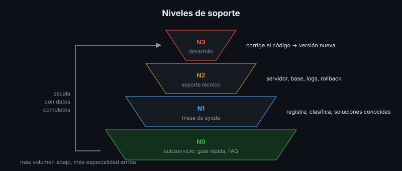
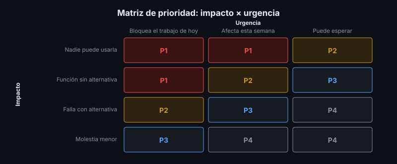

# Soporte por Niveles

## 🎯 Objetivos

- Organizar el soporte en niveles con responsabilidades claras
- Priorizar solicitudes por impacto y urgencia
- Definir canales y tiempos de respuesta y de solución
- Escribir procedimientos de atención (*runbooks*) y análisis posteriores a un incidente

## 📋 Contenido

### 1. Por qué por niveles

Si cada consulta llega a quien escribió el código, el equipo deja de desarrollar y las consultas
simples esperan igual que las graves. Los niveles filtran: cada nivel resuelve lo que puede y
escala lo que no, **con la información completa**.

| Nivel | Quién | Resuelve | Ejemplo en la app de referencia |
|---|---|---|---|
| **N0** — Autoservicio | El propio usuario | Dudas de uso | Guía rápida, preguntas frecuentes |
| **N1** — Mesa de ayuda | Personal de soporte general | Consultas, registro, clasificación, soluciones conocidas | "No sé cómo registrar un libro"; reiniciar con el procedimiento |
| **N2** — Soporte técnico | Quien opera el servidor | Configuración, datos, infraestructura | La app responde 503: revisar la base, logs, rollback |
| **N3** — Desarrollo | El equipo que construyó el software | Defectos del código | El ISBN duplicado produce error 500: corrección y nueva versión |

Cada escalamiento lleva lo que ya se sabe y lo que ya se intentó. Un reporte que llega a N3 sin
pasos para reproducir vuelve a empezar.

### 2. Incidente y solicitud

| | Incidente | Solicitud |
|---|---|---|
| Qué es | Algo que funcionaba dejó de funcionar | Algo nuevo o un cambio: crear una cuenta, un reporte |
| Objetivo | Restablecer el servicio **rápido**; la causa se estudia después | Atender en el plazo acordado |

### 3. Prioridad = impacto × urgencia

- **Impacto**: a cuántos afecta y cuánto (todos sin servicio, una función sin alternativa, una
  molestia).
- **Urgencia**: cuánto puede esperar (bloquea el trabajo de hoy, de esta semana, puede esperar).

El formulario de reporte de la app de referencia
([`reporte-de-falla.yml`](../../../referencia/.github/ISSUE_TEMPLATE/reporte-de-falla.yml))
pregunta ambos, además de la versión y los pasos para reproducir.

### 4. Tiempos acordados

| Prioridad | Primera respuesta | Solución o alternativa | Ejemplo |
|---|---|---|---|
| P1 — Crítica | 1 h hábil | 4 h hábiles | Nadie puede entrar |
| P2 — Alta | 4 h hábiles | 2 días hábiles | No se pueden registrar libros |
| P3 — Media | 1 día hábil | 5 días hábiles | Un filtro falla, hay alternativa |
| P4 — Baja | 2 días hábiles | Próxima versión | Error de ortografía |

Estos tiempos son un **ejemplo**. Los reales se acuerdan con el cliente según los recursos del
equipo y quedan en el acta de entrega (semana 9) como niveles de servicio. Prometer "24/7" sin
personas que lo cubran es incumplir desde el primer día.

| Término | Significado |
|---|---|
| **SLA** | Acuerdo con el cliente: qué se compromete y qué pasa si no se cumple |
| **SLO** | Objetivo interno medible (por ejemplo, disponibilidad del 99,5 % al mes) |
| **SLI** | La medición real (la disponibilidad que reporta Uptime Kuma) |

### 5. Canales

Un solo punto de entrada registrado (formulario, correo de soporte, sistema de tickets como
GitHub Issues, GLPI o Zammad), con horario publicado. Los mensajes directos a una persona se
pierden cuando esa persona no está. El chat sirve para coordinar un incidente, no para registrarlo.

### 6. Runbooks

Un *runbook* es el procedimiento paso a paso para una situación conocida, escrito para que otra
persona (N1 o N2) lo siga sin improvisar:

| Sección | Contenido |
|---|---|
| Síntoma | Qué se observa: la alerta "Biblioteca — salud" está en rojo |
| Verificación | `curl .../api/health`, `docker compose ps` |
| Acciones | En orden, con el resultado esperado de cada una |
| Escalamiento | Si nada funciona: a quién, con qué datos |
| Cierre | Cómo confirmar que se resolvió y qué registrar |

Toda alerta del monitoreo (semana 7) debería tener su runbook.

### 7. Análisis posterior al incidente

Después de un incidente P1 o P2 se escribe un análisis **sin culpables**: línea de tiempo, causa,
qué funcionó, qué no, y acciones con responsable y fecha. Se busca corregir el sistema, no señalar
a una persona.

### 8. Aplicación al proyecto real

Define los niveles de soporte de tu proyecto, quién los cubre, los canales, la matriz de
prioridad con tiempos propuestos y al menos dos runbooks.

## 📚 Recursos Adicionales

Ver [`4-recursos/webgrafia/`](../4-recursos/webgrafia/README.md).
