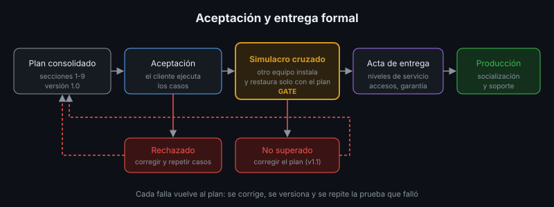

# Pruebas de Aceptación

## 🎯 Objetivos

- Diferenciar las pruebas de aceptación de las pruebas técnicas
- Derivar casos de aceptación de los requisitos del cliente
- Definir criterios de entrada, de salida y de severidad de los defectos
- Tomar y documentar una decisión de puesta en producción

## 📋 Contenido

### 1. ¿Quién acepta?

Las pruebas de las semanas 5 y 7 (prueba de humo, CI) las hace el **equipo** para saber si el
software funciona. Las pruebas de aceptación (UAT, *User Acceptance Testing*) las hace el
**cliente** —o usuarios que lo representan— para decidir si el software **sirve** para lo que
se pidió.

| | Pruebas técnicas | Pruebas de aceptación |
|---|---|---|
| Quién ejecuta | El equipo, el pipeline | Usuarios del cliente, acompañados por el equipo |
| Pregunta | ¿Funciona como lo construimos? | ¿Hace lo que necesitamos? |
| Base | El código, la API | Los requisitos acordados |
| Ambiente | CI, laboratorio | Uno igual a producción, con datos de prueba realistas |
| Resultado | Verde o rojo | Aceptado, aceptado con observaciones, rechazado |

### 2. De requisito a caso de aceptación

Cada requisito acordado produce uno o más casos, escritos en el lenguaje del usuario:

| Requisito | Caso de aceptación |
|---|---|
| RQ-02: registrar libros con ISBN, título, autor y año | **CA-02**: *Dado* que estoy en el catálogo, *cuando* registro un libro con todos los datos, *entonces* aparece en el catálogo |
| RQ-03: no permitir libros duplicados | **CA-03**: *Dado* un libro ya registrado, *cuando* intento registrar otro con el mismo ISBN, *entonces* veo un aviso y no se crea el duplicado |

El formato *Dado / Cuando / Entonces* obliga a decir el estado inicial, la acción y el resultado
observable. Si un requisito no se puede convertir en un caso, el requisito está mal escrito.

### 3. Plan de pruebas de aceptación

| Elemento | Contenido |
|---|---|
| Alcance | Requisitos que se prueban (y los que no, con el motivo) |
| Ambiente | Dónde: instalación igual a producción, versión exacta |
| Datos | Datos de prueba realistas y sintéticos; nunca datos personales reales |
| Participantes | Quién ejecuta (usuarios), quién acompaña (equipo), quién decide |
| Criterios de entrada | Qué debe cumplirse para empezar: CI en verde, prueba de humo, capacitación hecha |
| Criterios de salida | Qué debe cumplirse para aceptar (sección 5) |
| Registro | Resultado por caso, evidencia, defectos encontrados |

### 4. Severidad de los defectos

| Severidad | Significado | Ejemplo |
|---|---|---|
| **Bloqueante** | Impide una tarea principal, sin alternativa | No se pueden registrar libros |
| **Mayor** | Una tarea falla, hay alternativa costosa | El duplicado se crea sin aviso |
| **Menor** | Molestia, la tarea se completa | Mensaje de error poco claro |
| **Cosmético** | Visual, sin efecto en la tarea | Error de ortografía |

### 5. Criterios de salida y decisión

Ejemplo de criterios acordados antes de empezar:

- 100 % de los casos ejecutados
- 0 defectos bloqueantes y 0 mayores abiertos
- Defectos menores con fecha de corrección acordada

| Decisión | Cuándo |
|---|---|
| **Aceptado** | Cumple todos los criterios |
| **Aceptado con observaciones** | Solo defectos menores o cosméticos, con plan de corrección en el acta |
| **Rechazado** | Algún bloqueante o mayor abierto: se corrige y se repiten los casos afectados |

La decisión se toma con el cliente, se registra con fecha y firmas y alimenta el acta de entrega
(teoría 03). Si se acordaron **después** de probar, los criterios dejan de proteger a ambas
partes.

### 6. Aplicación al proyecto real

Escribe los casos de aceptación de tu proyecto a partir de sus requisitos, acuerda los criterios
de salida y ejecútalos con alguien que haga de cliente.

## 📚 Recursos Adicionales

Ver [`4-recursos/webgrafia/`](../4-recursos/webgrafia/README.md).
