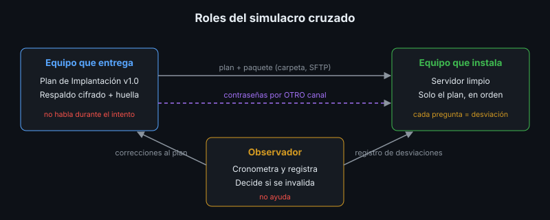

# Simulacro Cruzado: el Gate del Plan de Implantación

## 🎯 Objetivos

- Explicar por qué el Plan de Implantación se valida con otro equipo
- Aplicar las reglas y los roles del simulacro
- Registrar desviaciones y distinguir las que invalidan el plan
- Corregir el plan a partir del simulacro

## 📋 Contenido

### 1. Por qué un simulacro

Un plan que solo ha seguido quien lo escribió no está probado: quien lo escribió completa sin
darse cuenta los pasos que faltan. La prueba real es que **otra persona**, sin ayuda, instale el
software desde cero y recupere sus datos. Es lo que pasará el día que el equipo original ya no
esté, o el día del desastre.

El simulacro es la condición de aprobación del Producto del bootcamp: si falla, el Plan de
Implantación no se acepta hasta corregirlo y repetirlo.

### 2. Roles

| Rol | Hace | No hace |
|---|---|---|
| **Equipo que entrega** | Entrega el plan, el paquete (respaldo, huella) y, por otro canal, las contraseñas | Hablar durante el simulacro |
| **Equipo que instala** | Sigue el plan paso a paso, en orden, en un servidor limpio | Usar conocimiento propio para completar lo que falta |
| **Observador** (instructor u otro equipo) | Cronometra, registra cada desviación, decide si una ayuda invalida el intento | Ayudar |

### 3. Reglas

1. **Solo el plan.** Lo que no está escrito no existe. Si un paso falta, es ambiguo o falla, se
   registra.
2. **Servidor limpio.** VM sin la app, o una carpeta y un proyecto de Compose nuevos, sin
   imágenes ni volúmenes previos del proyecto.
3. **Secretos por otro canal.** El plan y el paquete no contienen contraseñas; se entregan aparte.
4. **Tiempo máximo acordado** (por ejemplo, 90 minutos). Pasado ese tiempo, el intento termina.
5. **Una pregunta = una desviación.** El equipo que instala puede preguntar, pero cada respuesta
   se registra como un defecto del plan.

### 4. Qué debe lograrse

| # | Criterio | Evidencia |
|---|---|---|
| 1 | Requisitos verificados | Salida del script de verificación (semana 1) |
| 2 | Instalación completa desde cero | `docker compose ps` con servicios sanos |
| 3 | Datos restaurados desde el respaldo cifrado | Huella restaurada idéntica a la entregada |
| 4 | Verificación posterior | Prueba de humo en verde con la versión esperada |
| 5 | Dentro del tiempo | Duración total ≤ tiempo máximo y comparada con el RTO del plan |

### 5. Registro de desviaciones

| Tipo | Ejemplo | ¿Invalida el intento? |
|---|---|---|
| **Paso faltante** | El plan no dice que hay que construir la imagen | Sí, si no se pudo continuar sin ayuda |
| **Paso ambiguo** | "Configura el `.env`" sin decir qué valores | Sí, si se necesitó preguntar |
| **Paso erróneo** | Una ruta o un comando que no existe | Sí, si no se pudo continuar sin ayuda |
| **Orden incorrecto** | Restaurar después de que la app creó las tablas | Según el efecto |
| **Supuesto no escrito** | El plan asume que el puerto 80 está libre | No, si se resolvió con el propio plan |
| **Mejora** | Un paso funciona pero podría ser más claro | No |

El registro lo firma el observador. Cada desviación se convierte en un cambio del plan.

### 6. Después del simulacro

1. El equipo que entrega corrige el plan con cada desviación y sube la versión del plan.
2. Si el intento se invalidó, se repite (con el mismo u otro equipo) solo sobre la versión corregida.
3. El resultado —duración, desviaciones, huellas— queda en la sección 10 del plan y en el acta.

### 7. Aplicación al proyecto real

Prepara el paquete de entrega de tu proyecto (plan, respaldo cifrado, huella), acuerda el tiempo
máximo y organiza con el instructor qué equipo instala tu proyecto y cuál instalas tú.

## 📚 Recursos Adicionales

Ver [`4-recursos/webgrafia/`](../4-recursos/webgrafia/README.md).
