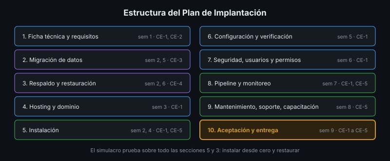

# Consolidación del Plan y Socialización

## 🎯 Objetivos

- Consolidar las secciones semanales en un Plan de Implantación coherente
- Verificar la completitud del plan con una lista objetiva
- Presentar los resultados de la implantación en poco tiempo
- Dar y recibir retroalimentación útil

## 📋 Contenido

### 1. De ocho entregables a un documento

Cada semana produjo una sección. Juntas no forman todavía un plan: hay versiones distintas, pasos
que se contradicen y referencias a prácticas del bootcamp que el lector del plan no tiene.

| Revisión | Pregunta |
|---|---|
| **Versiones** | ¿Todas las secciones hablan de la misma versión del software, de la base y del SO? |
| **Coherencia** | ¿El plan de respaldo de la sección 3 es el que realmente corre? ¿Las variables de la sección 6 coinciden con el `.env.example`? |
| **Autonomía** | ¿Se entiende sin haber cursado el bootcamp? Nada de "como en la práctica 02" |
| **Ejecutabilidad** | ¿Cada paso de instalación y restauración dice exactamente qué hacer y cómo verificarlo? |
| **Secretos** | ¿Hay alguna contraseña, token, IP o dato personal real? |
| **Enlaces** | ¿Los enlaces a scripts y archivos del repositorio funcionan? |

El modelo es el plan de la app de referencia:
[`referencia/docs/plan-implantacion.md`](../../../referencia/docs/plan-implantacion.md).

### 2. Lista de completitud

| Sección | Mínimo para estar completa |
|---|---|
| 1. Ficha técnica | Arquitectura, versiones, requisitos, resultado del script de verificación |
| 2. Migración | Origen, destino, método, validación por huella, rollback, evidencia ejecutada |
| 3. Respaldo | RPO/RTO, herramienta, cifrado, 3-2-1, retención, **procedimiento de restauración probado** |
| 4. Hosting y dominio | Tipo de hosting, dominio, HTTPS, transferencia de archivos |
| 5. Instalación | Prerrequisitos y pasos numerados con verificación, servidor y nube |
| 6. Configuración | Variables por ambiente, servicios, healthchecks, pruebas |
| 7. Seguridad | Matriz de usuarios y roles, firewall, secretos |
| 8. Pipeline y monitoreo | Workflows, rollback, monitores y alertas |
| 9. Mantenimiento, soporte, capacitación | Calendario, niveles, runbooks, plan de capacitación, ayudas |
| 10. Aceptación y entrega | Resultado de la aceptación, del simulacro y enlace al acta |

### 3. Versionar el plan

El plan tiene su propia versión (1.0, 1.1…) y un registro de cambios. El simulacro se hace sobre
una versión concreta; las correcciones producen la siguiente. El plan vive en el repositorio del
proyecto (`docs/plan-implantacion.md`), junto al código que describe.

### 4. Socialización

Una presentación corta de los resultados de la implantación al cliente y a los demás equipos.
Estructura sugerida para 10 minutos:

| Minutos | Contenido |
|---|---|
| 1 | Qué es el software y para quién |
| 2 | Arquitectura e implantación: dónde y cómo corre |
| 2 | Demostración en vivo: la app en producción y el monitoreo |
| 2 | Resultado del simulacro: tiempo, desviaciones, qué se corrigió |
| 2 | Riesgos y pendientes: lo que falta y cómo se va a atender |
| 1 | Preguntas |

Lo que se presenta son **resultados con evidencia** (tiempos, huellas, enlaces a ejecuciones), no
una lista de tecnologías usadas. Mostrar un problema encontrado y cómo se resolvió genera más
confianza que una demostración perfecta.

### 5. Retroalimentación

| Al dar | Al recibir |
|---|---|
| Concreta: "en el paso 5.4 no se sabe qué dominio usar" | Escuchar sin defender; preguntar para entender |
| Sobre el plan o el software, no sobre las personas | Anotar todo; decidir después qué se cambia |
| Con una sugerencia de mejora | Agradecer: cada observación es un defecto encontrado antes del cliente |

### 6. Lecciones aprendidas

Al cierre, cada equipo registra: qué funcionó, qué no, qué haría distinto en la próxima
implantación. Es el mismo principio del análisis sin culpables (semana 8) aplicado al proyecto.

### 7. Aplicación al proyecto real

Consolida el Plan de Implantación de tu proyecto con la lista de la sección 2, prepara la
presentación de 10 minutos y registra las lecciones aprendidas del equipo.

## 📚 Recursos Adicionales

Ver [`4-recursos/webgrafia/`](../4-recursos/webgrafia/README.md).
