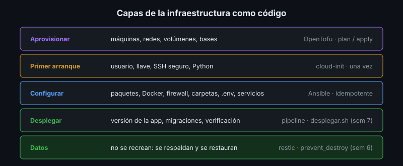

# Infraestructura como Código

## 🎯 Objetivos

- Explicar qué es la infraestructura como código (IaC) y qué problema resuelve
- Diferenciar el enfoque declarativo del imperativo
- Definir idempotencia, convergencia y deriva
- Ubicar cloud-init, Ansible y OpenTofu en las capas de una implantación

## 📋 Contenido

### 1. Del documento al código

En la semana 9, otro equipo instaló tu proyecto leyendo el plan. Funcionó, pero cada instalación
depende de que alguien lea bien, escriba bien y no se salte un paso. La **infraestructura como
código** convierte ese procedimiento en archivos que una herramienta ejecuta: el plan de
instalación se vuelve **ejecutable**.

| Plan escrito | Plan ejecutable |
|---|---|
| Lo interpreta una persona | Lo interpreta una herramienta, siempre igual |
| Un paso olvidado se descubre en el simulacro | Un paso olvidado falla en la primera ejecución |
| Documenta lo que *debería* haber en el servidor | *Es* lo que hay en el servidor |
| Revisar un cambio = leer prosa | Revisar un cambio = un *pull request* con su diff |

El documento no desaparece: explica el porqué, los prerrequisitos y qué hacer si algo falla.

### 2. Imperativo y declarativo

| | Imperativo | Declarativo |
|---|---|---|
| Se escribe | **Cómo**: los pasos | **Qué**: el estado deseado |
| Ejemplo | `apt install docker.io && systemctl start docker` | "`docker.io` presente, servicio `docker` activo" |
| Segunda ejecución | Repite los pasos (y puede fallar o duplicar) | Compara y solo cambia lo que falta |
| Herramientas | Scripts de bash (`desplegar.sh`) | Ansible, OpenTofu, cloud-init |

### 3. Idempotencia, convergencia y deriva

- **Idempotencia**: ejecutar una vez o diez deja el mismo resultado. La segunda ejecución de un
  playbook bien escrito reporta `changed=0`.
- **Convergencia**: desde cualquier estado de partida (servidor nuevo, a medias, con cambios),
  la herramienta lleva el servidor al estado declarado.
- **Deriva** (*drift*): diferencia entre lo declarado y lo real, casi siempre por cambios a mano
  ("solo ajusté una línea en el servidor"). La IaC la detecta y la corrige; por eso, con IaC,
  **nadie cambia el servidor a mano**.

### 4. Capas y herramientas

| Capa | Pregunta | Herramienta | Semana |
|---|---|---|---|
| Aprovisionar | ¿Qué máquinas, redes y bases existen? | OpenTofu / Terraform | 10 |
| Primer arranque | ¿Cómo queda la máquina al encender la primera vez? | cloud-init | 10 |
| Configurar | ¿Qué paquetes, usuarios, archivos y servicios tiene? | Ansible | 10 |
| Desplegar | ¿Qué versión de la app corre? | Pipeline, `desplegar.sh` | 7 |
| Operar | ¿Sigue sana? | Monitoreo, mantenimiento | 7, 8 |

Cada herramienta hace bien lo suyo. Ansible puede crear máquinas y OpenTofu puede configurar
archivos, pero forzarlas fuera de su capa produce código difícil de mantener.

### 5. Buenas prácticas

- **Todo en Git**: el código de infraestructura se revisa por *pull request* como el de la app.
- **Secretos cifrados o fuera**: Ansible Vault, variables de entorno, gestor de secretos. Nunca
  en texto plano en el repositorio (semana 6).
- **Variables para lo que cambia** entre ambientes; el resto, fijo.
- **Probar en un servidor desechable** antes de producción: si reconstruirlo cuesta minutos,
  probar es barato.
- **Empezar pequeño**: automatizar primero lo que más se repite o más falla.

### 6. Servidores como ganado, no como mascotas

Un servidor "mascota" se configura a mano durante años y nadie se atreve a reemplazarlo. Uno
"ganado" se puede destruir y recrear desde código en minutos. La IaC permite lo segundo; los
**datos** son la excepción: viven en volúmenes o bases gestionadas con su plan de respaldo
(semana 6), y se protegen de un `destroy` por error.

### 7. Aplicación al proyecto real

Identifica qué pasos de la sección 5 de tu plan se repiten más o fallaron en el simulacro: son
los primeros candidatos a volverse código.

## 📚 Recursos Adicionales

Ver [`4-recursos/webgrafia/`](../4-recursos/webgrafia/README.md).
