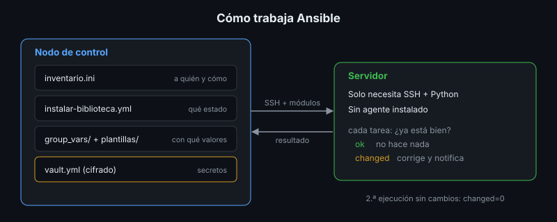

# Ansible: el Plan de Instalación Ejecutable

## 🎯 Objetivos

- Describir la arquitectura de Ansible: nodo de control, inventario, módulos
- Leer y escribir un playbook idempotente
- Usar variables, plantillas, *handlers* y Ansible Vault
- Evitar los errores que rompen la idempotencia

## 📋 Contenido

### 1. Arquitectura



- **Nodo de control**: la máquina donde está Ansible y el código (tu equipo o un runner de CI).
- **Servidores administrados**: solo necesitan SSH y Python. No se instala ningún agente.
- **Inventario**: la lista de servidores y cómo llegar a ellos, agrupados.
- **Módulos**: las unidades de trabajo (`apt`, `file`, `template`, `service`, `ufw`…). Cada
  módulo sabe comprobar el estado actual antes de cambiar nada.

### 2. Playbook

Un playbook es una lista de tareas para un grupo de servidores:

```yaml
- name: Instalar la biblioteca en un Ubuntu limpio
  hosts: biblioteca          # grupo del inventario
  become: true               # con sudo
  tasks:
    - name: Paquetes del sistema
      ansible.builtin.apt:
        name: [docker.io, docker-compose-v2, git, ufw]
        state: present       # declarativo: "presentes", no "instálalos"
```

El de la app de referencia,
[`instalar-biblioteca.yml`](../2-practicas/laboratorio/ansible/instalar-biblioteca.yml), convierte
las secciones 5 y 7 del plan en tareas: paquetes, Docker, grupo de despliegue, firewall, carpeta
`2770`, código de la versión, archivos, `.env` desde plantilla, imagen, servicios y prueba de humo.

Cada tarea reporta `ok` (ya estaba bien), `changed` (lo cambió), `skipping` o `failed`.

### 3. Variables, plantillas y secretos

| Elemento | Dónde | Ejemplo |
|---|---|---|
| Variables del grupo | `group_vars/biblioteca/vars.yml` | `app_version`, `dominio` |
| Secretos cifrados | `group_vars/biblioteca/vault.yml` (Ansible Vault) | `vault_postgres_password` |
| Plantillas Jinja2 | `plantillas/env.j2`, `plantillas/Caddyfile.j2` | `DOMINIO={{ dominio }}` |
| Desde la línea de comandos | `-e app_version=1.1.0` | Actualizar la versión |

Ansible Vault cifra archivos con AES-256. El archivo cifrado **sí** se versiona; la contraseña del
vault, nunca. Las tareas que manejan secretos llevan `no_log: true` para que no aparezcan en la
salida (ni en el diff).

### 4. Handlers

Un *handler* se ejecuta **solo si** alguna tarea lo notificó con cambios, y una sola vez al final:

```yaml
    - name: Configuración (.env) desde la plantilla
      ansible.builtin.template: { src: plantillas/env.j2, dest: /opt/biblioteca/.env }
      notify: Aplicar cambios
  handlers:
    - name: Aplicar cambios
      ansible.builtin.command: docker compose up -d --wait --force-recreate
```

Si `.env` no cambió, los contenedores no se reinician.

### 5. Ejecutar con cuidado

```bash
ansible biblioteca -m ping                                   # ¿llego a los servidores?
ansible-playbook instalar-biblioteca.yml --check --diff     # qué cambiaría, sin cambiar
ansible-playbook instalar-biblioteca.yml                    # aplicar
ansible-playbook instalar-biblioteca.yml                    # otra vez: debe dar changed=0
```

### 6. Lo que rompe la idempotencia

| Error | Síntoma | Corrección |
|---|---|---|
| `command` o `shell` sin condiciones | `changed` en cada ejecución | `creates:`, `when:`, o `changed_when:` según la salida |
| Copiar un archivo y luego editarlo | La copia lo restaura y la edición lo vuelve a cambiar, **cada vez** | Generarlo completo con `template` |
| Descargar "la última versión" | Cada ejecución puede instalar algo distinto | Versiones fijas en variables |
| Cambios a mano en el servidor | Ansible los revierte sin avisar | Todo cambio pasa por el playbook |

El segundo caso ocurrió de verdad al escribir el playbook de la app de referencia: el `Caddyfile`
se copiaba del código y luego se le activaba `tls internal`. La segunda ejecución reportaba
`changed=3`. Con una plantilla, `changed=0`.

### 7. Roles

Cuando un playbook crece, se divide en **roles** reutilizables (`roles/docker`, `roles/firewall`,
`roles/biblioteca`), cada uno con sus tareas, plantillas, variables y handlers. Ansible Galaxy
publica roles de la comunidad; úsalos leyendo su código, como cualquier dependencia (semana 8).

### 8. Instalación y despliegue

El playbook **instala** (deja el servidor como debe estar). Las **actualizaciones** de versión
siguen el procedimiento de la semana 7 (`desplegar.sh`: respaldo, migraciones, verificación y
rollback), que el playbook puede invocar o dejar al pipeline.

### 9. Aplicación al proyecto real

Convierte la sección 5 de tu plan en un playbook idempotente, con los secretos en Vault.

## 📚 Recursos Adicionales

Ver [`4-recursos/webgrafia/`](../4-recursos/webgrafia/README.md).
