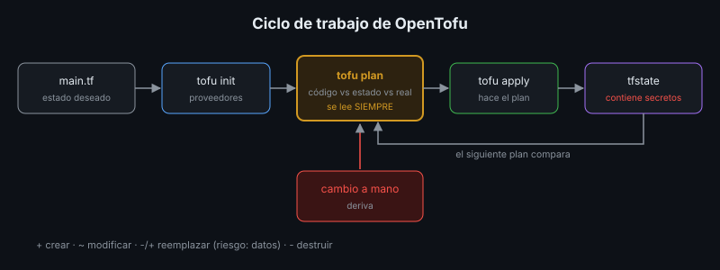

# OpenTofu: Aprovisionar Infraestructura

## 🎯 Objetivos

- Describir proveedores, recursos, variables y salidas en OpenTofu
- Aplicar el ciclo `init`, `plan`, `apply`, `destroy`
- Explicar el estado, sus riesgos y la deriva
- Proteger los datos de una destrucción accidental

## 📋 Contenido

### 1. OpenTofu y Terraform

Terraform popularizó el aprovisionamiento declarativo con el lenguaje HCL. En 2023 cambió a una
licencia no libre (BUSL); la comunidad creó **OpenTofu**, su bifurcación de código abierto (MPL,
bajo la Linux Foundation). Los archivos son compatibles en lo esencial: lo aprendido sirve para
ambos. En este bootcamp se usa OpenTofu por ser código abierto.

### 2. Piezas

| Pieza | Qué es | En el ejemplo |
|---|---|---|
| **Proveedor** | *Plugin* que habla con una plataforma | `kreuzwerker/docker` (Docker local) |
| **Recurso** | Algo que existe en la plataforma | Red, volumen, contenedores `db` y `app` |
| **Variable** | Entrada configurable | `app_version`, `puerto`, `postgres_password` |
| **Salida** | Dato útil después de aplicar | `url` |
| **Estado** | Lo que OpenTofu sabe que creó | `terraform.tfstate` |

El ejemplo, [`main.tf`](../2-practicas/laboratorio/opentofu/main.tf), describe la app de
referencia con el Docker de tu equipo como "nube": gratis y sin cuentas. Con otro proveedor
—un hipervisor, una nube pública, Render (tiene proveedor oficial)— cambian los recursos, no el
ciclo.

### 3. Ciclo



```bash
tofu init       # descarga los proveedores
tofu plan       # compara código, estado y realidad; muestra qué haría
tofu apply      # hace lo del plan (pide confirmación)
tofu destroy    # borra todo lo que creó
```

`plan` es la parte más importante: se lee **siempre** antes de `apply`. Distingue:

| Símbolo | Significado | Riesgo |
|---|---|---|
| `+` crear | Recurso nuevo | Bajo |
| `~` modificar | Cambia en su lugar | Medio |
| `-/+` reemplazar | Se destruye y se crea de nuevo (`forces replacement`) | **Alto**: en una base, puede ser perder datos |
| `-` destruir | Se borra | **Alto** |

### 4. Estado

El archivo de estado relaciona cada recurso del código con el objeto real. Dos cuidados:

- **Contiene secretos en texto plano.** La contraseña marcada como `sensitive` no se muestra en
  pantalla, pero está en `terraform.tfstate`. Nunca va al repositorio.
- **Es único.** Si dos personas aplican con copias distintas del estado, OpenTofu pierde la
  cuenta de lo que existe. En equipos, el estado vive en un *backend* remoto con bloqueo y
  cifrado (OpenTofu soporta cifrado del estado).

### 5. Deriva

Si alguien borra o cambia a mano un recurso, el siguiente `plan` lo detecta y propone volver al
estado declarado. Cambiar una variable que forma parte de un recurso inmutable (por ejemplo, la
contraseña en las variables de entorno de un contenedor) **reemplaza** el recurso.

### 6. Proteger los datos

`tofu destroy` borra también el volumen de la base. Para los recursos con datos:

```hcl
resource "docker_volume" "datos" {
  name = "biblioteca-tofu-datos"
  lifecycle {
    prevent_destroy = true   # cualquier plan que lo destruya falla
  }
}
```

Y los datos siguen necesitando su plan de respaldo (semana 6): la IaC recrea la infraestructura,
no los datos.

### 7. ¿Cuándo vale la pena?

| Situación | ¿OpenTofu? |
|---|---|
| Un servidor, creado una vez | Probablemente no: cloud-init + Ansible bastan |
| Varios ambientes iguales (pruebas, producción) | Sí |
| Recursos de nube que cambian (bases, DNS, balanceadores) | Sí |
| Recrear todo tras un desastre | Sí: el plan de recuperación se vuelve `tofu apply` + restaurar datos |

### 8. Aplicación al proyecto real

Identifica qué infraestructura de tu proyecto podría describirse con OpenTofu y qué proveedor
usarías. No es obligatorio aplicarlo.

## 📚 Recursos Adicionales

Ver [`4-recursos/webgrafia/`](../4-recursos/webgrafia/README.md).
